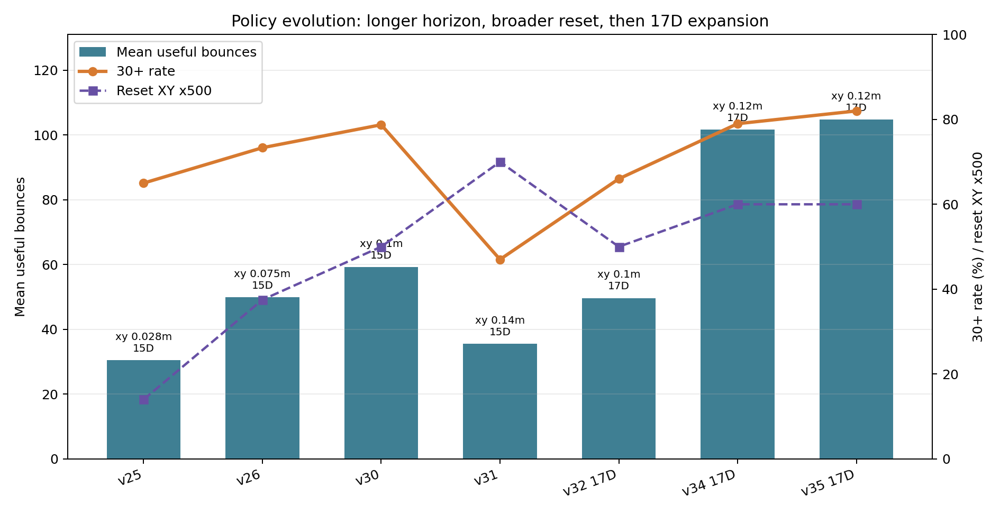

# 실험 스토리라인

## 한 줄 요약

이 프로젝트의 핵심 시행착오는 “공을 올리도록 reward만 주면 RL이 알아서 잘 치는가?”가 아니었다. 실제로는 접촉 가능성, action ownership, episode horizon, reset distribution, useful contact 기준, action-space 확장을 단계적으로 맞춰야 했다.

발표에서는 아래 문장으로 시작하면 좋다.

> 처음에는 보상만 잘 주면 될 것처럼 보였지만, 실제로는 물리 접촉이 매우 희소하고 실패 모드가 다양해서, 강화학습이 배울 수 있는 action과 관측, curriculum, 평가 기준을 함께 설계해야 했다.

## 1. 초반 교훈: PPO를 더 돌리는 것이 답이 아니었다

관련 보고서:

- [00_pre_v25_trial_history.md](00_pre_v25_trial_history.md)
- [06_learning_design_checklist.md](../report/06_learning_design_checklist.md)
- [15_contact_feasibility_map_report.md](../report/15_contact_feasibility_map_report.md)
- [26_learning_runtime_parallel_and_v2_diagnosis.md](../report/26_learning_runtime_parallel_and_v2_diagnosis.md)
- [36_rl_action_ownership_and_8d_residual_plan.md](../report/36_rl_action_ownership_and_8d_residual_plan.md)

초기 실험에서는 reward를 계속 조정하거나 학습 시간을 늘리는 것만으로는 성능이 오르지 않았다. v2 계열은 2M step까지 갔지만 mean useful bounce가 거의 오르지 않았고, failure가 `ball_out_of_bounds`, `robot_body_contact`, `floor_contact`로 갈라졌다.

이때 얻은 결론:

- 좋은 contact가 드물게 나오면 contact 품질은 괜찮았다.
- 문제는 대부분의 episode가 그 좋은 contact 상태까지 가지 못한다는 점이었다.
- 따라서 reward 숫자 조정 전에 라켓이 타격 위치에 도착하고, 팔이 공을 막지 않고, contact 순간 속도/자세가 안정되는 구조가 필요했다.

발표 포인트:

- “학습이 안 됐다”를 실패로만 말하지 말고, `reward shaping`보다 `action/control abstraction`이 먼저라는 교훈으로 말한다.
- scripted feasibility map도 `max useful 2` 근처에서 막혔기 때문에, 단순 PID/heuristic만으로 장기 랠리를 만들기 어렵다는 근거가 된다.

## 2. v25: 성능 상승은 reward 대개편보다 horizon과 평가 기준에서 왔다

관련 보고서:

- [46_v23_v24_review_and_v25_30_bounce_horizon.md](../report/46_v23_v24_review_and_v25_30_bounce_horizon.md)
- [47_run_ppo_learning_preset_config_reference.md](../report/47_run_ppo_learning_preset_config_reference.md)

v25의 핵심은 `max_episode_steps=600`에서 `1800`으로 늘리고, 평가 기준을 `30+ useful bounce`에 맞춘 것이다. 즉 정책이 이미 가진 반복 능력을 더 오래 드러낼 수 있게 한 변화다.

v25 training summary 기준:

- mean useful: `30.41`
- max useful: `48`
- 30+ rate: `65%`
- failure: `time_limit=52`, `low_apex=20`, `ball_out=8`

발표 포인트:

- “강화학습 성능”은 모델만의 문제가 아니라 평가 horizon과 checkpoint 선택 기준에 매우 민감하다.
- `time_limit`이 많아졌다는 것은 실패가 아니라, safety cap까지 살아남는 episode가 많아졌다는 뜻이다.

추천 시각화:



## 3. v26-v31: reset distribution을 넓히면 성능이 바로 흔들린다

관련 보고서:

- [48_v26_unlimited_broad_xyz_reset.md](../report/48_v26_unlimited_broad_xyz_reset.md)
- [50_v28_tracking_spin_analysis_and_v29_staged_distribution.md](../report/50_v28_tracking_spin_analysis_and_v29_staged_distribution.md)
- [52_v30_review_and_short_model_names.md](../report/52_v30_review_and_short_model_names.md)
- [53_keep1_v31_wider_xy_and_keep2_model_plan.md](../report/53_keep1_v31_wider_xy_and_keep2_model_plan.md)

v26은 무제한 episode와 broad XYZ reset을 넣었다. 이때부터 단순히 “계속 친다”보다 “다양한 초기 위치/속도에서도 살린다”가 과제가 됐다.

v28은 `xy=0.16m`, 초기 lateral velocity, z velocity, spin을 한 번에 크게 키운 실험이다. 결과는 mean useful `8.16`, 30+ rate `8.75%`로 낮았다. 이 실험은 실패라기보다 난도를 한 번에 올리면 policy가 tracking residual을 제대로 쓰지 못한다는 증거였다.

v30은 보수적인 성공 사례다.

- v26 안정 모델에서 이어받음
- action mode는 15D 유지
- reset XY만 `0.075m -> 0.10m`
- training summary mean useful `59.19`, 30+ rate `78.75%`

v31은 `xy=0.14m`까지 넓혔지만 ball-out/body contact가 늘어 성능이 떨어졌다. 이 흐름은 발표에서 curriculum의 필요성을 잘 보여준다.

발표 포인트:

- v29/v31은 “망한 모델”이 아니라, 난도 확장을 한 번에 크게 주면 실패 모드가 바뀐다는 실험 자료다.
- v30은 “한 번에 하나씩 넓히기”가 더 안정적이라는 근거다.

추천 시각화:


## 4. v32-v35: 15D에서 17D로, 그리고 장기 랠리 목표로

관련 보고서:

- [49_racket_center_tracking_spin_and_two_ball_plan.md](../report/49_racket_center_tracking_spin_and_two_ball_plan.md)
- [54_v32_17d_transfer_finetune_report.md](../report/54_v32_17d_transfer_finetune_report.md)
- [07_v35_training_review_and_next_plan.md](07_v35_training_review_and_next_plan.md)

17D는 15D 뒤에 tracking velocity residual x/y를 붙인 모델이다.

```text
15D + [tracking_vx, tracking_vy]
```

v32에서는 기존 15D v30 모델을 바로 버리지 않고, policy/value weight를 복사한 뒤 새 action head 2개만 zero-init했다. 이 덕분에 17D 모델이 처음부터 기존 안정성을 잃지 않았다.

v33과 v34는 장기 랠리 목표에 맞춰 다시 평가했다. 1800-step 분석은 `30+ useful` 정도를 보기에는 적당하지만, `contacts 300 / useful 100`을 보기에는 짧다. 그래서 7200-step long analysis가 필요했다.

7200-step / 20 episodes 기준:

| 모델 | mean contacts | mean useful | contacts>=300 & useful>=100 | contacts>=400 & useful>=150 |
| --- | ---: | ---: | ---: | ---: |
| v32 17D | 223.25 | 79.65 | 6/20 | 1/20 |
| v33 17D | 237.80 | 91.15 | 9/20 | 2/20 |
| v34 17D | 318.55 | 116.05 | 13/20 | 9/20 |
| v35 17D | 278.05 | 102.30 | 11/20 | 4/20 |

v34에서 바뀐 것:

- `reset_xy_range=0.12`
- `reset_ball_height_bounds=[0.22,0.52]`
- `reset_velocity_xy_range=0.035`
- `reset_velocity_z_range=[-0.12,0.04]`
- `stable_cycle_reward_cap=30`
- `low_apex_contact_grace_count=6`
- `evaluation_step_limit=7200`

발표 포인트:

- v34는 “더 쉬운 조건에서 좋아진 것”이 아니라, z/xy/velocity 범위를 넓힌 상태에서 장기 랠리 지표가 올라간 것이다.
- low-apex threshold를 무작정 낮춘 것이 아니라, useful 기준은 유지하고 recovery grace를 늘렸다.
- v35는 body contact를 줄였지만 long-horizon 목표에서는 v34보다 약해졌다. 따라서 최종 선택 기준은 training reward가 아니라 장기 랠리 분석이다.

추천 시각화:


## 5. 현재 병목과 다음 실험

v34는 low-apex가 크게 줄었다. long 20 episode 분석에서는 low-apex failure가 `0/20`이었다. 대신 병목이 바뀌었다.

- `ball_out_of_bounds`: 5/20
- `robot_body_contact`: 3/20, 특히 `link5`
- `ball_speed_limit`: 1/20

v35에서는 lateral stability와 body clearance를 강하게 밀어봤다. 그 결과 robot body contact는 `3/20 -> 1/20`으로 줄었지만, `contacts>=400 & useful>=150`은 `9/20 -> 4/20`으로 떨어졌다.

따라서 다음 실험은 action 차원을 더 키우거나 영역을 바로 넓히는 것이 아니라, v34에서 v35의 장점만 약하게 가져오는 balanced fine-tune이 맞다.

발표에서의 결론:

> 최종 모델은 단순 PID처럼 같은 동작을 반복하는 것이 아니라, 넓어진 초기 위치/속도와 장기 랠리 지표에 맞춰 residual action을 학습했다. 다만 현재 한계는 low-apex보다 ball-out과 body contact로 바뀌었고, 이것이 다음 개선 방향이다.
