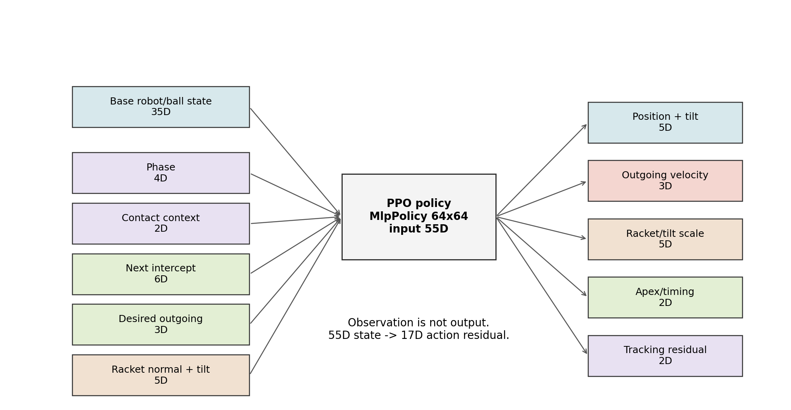

# 17D action과 55D observation 검증

## 한 줄 요약

현재 v34 모델은 `55D observation -> PPO policy -> 17D action residual` 구조다. 55D는 output이 아니라 입력 상태이고, 17D가 실제 policy action이다. action 사용량만 보면 몇 축이 약해 보이지만, ablation 결과상 지금은 축을 삭제하지 않는 것이 맞다.

추천 시각화:



## 1. 55D observation 구성

v34 기준 observation slice:

| 구성 | 차원 | 의미 |
| --- | ---: | --- |
| joint positions | 7 | 로봇 관절 위치 |
| joint velocities | 7 | 로봇 관절 속도 |
| racket position | 3 | 라켓 위치 |
| racket velocity | 3 | 라켓 속도 |
| target position | 3 | controller target |
| ball position | 3 | 공 위치 |
| ball velocity | 3 | 공 속도 |
| ball relative position | 3 | 라켓 기준 공 위치 |
| predicted intercept relative xy | 2 | 예측 접촉 XY |
| predicted intercept time | 1 | 예측 접촉 시간 |
| phase one-hot | 4 | prepare/strike/recovery 등 task phase |
| contact context | 2 | contact 이후 시간, 성공 bounce count |
| next intercept | 6 | 다음 공이 reachable한지와 XY/time 정보 |
| desired outgoing velocity | 3 | 다음 랠리를 만들 목표 outgoing 속도 |
| racket face normal | 3 | 라켓 면 방향 |
| target tilt | 2 | 현재 target tilt |

합계: `55D`

발표 포인트:

- `next_intercept`, `desired_outgoing_velocity`는 17D residual이 다음 공을 살리도록 쓰는 핵심 상태다.
- 단순히 공 위치/속도만 보는 것이 아니라, 다음 접촉 가능성까지 observation에 넣었다.

## 2. 17D action 구성

v34 action mode:

```text
position_contact_frame_velocity_tilt_lateral_apex_tracking_residual
```

action layout:

| index | action | 역할 | v34 사용 해석 |
| ---: | --- | --- | --- |
| 0 | radial | contact-frame radial 위치 보정 | 중간 사용 |
| 1 | tangent | tangent 위치 보정 | 약한 사용 |
| 2 | z | 타격 높이 위치 보정 | 중간 사용 |
| 3 | tilt_pitch | pitch tilt 보정 | 큰 사용 |
| 4 | tilt_roll | roll tilt 보정 | 매우 큰 사용, ablation상 효용은 애매 |
| 5 | vz_scale | outgoing z velocity scale | 약한 사용 |
| 6 | outgoing_x | 목표 outgoing x 보정 | 매우 중요 |
| 7 | outgoing_y | 목표 outgoing y 보정 | 중간 사용 |
| 8 | racket_vz | 라켓 z velocity 보정 | 약한 사용 |
| 9 | trajectory_tilt_scale | trajectory tilt scale | 약한 사용 |
| 10 | centering_tilt_scale | centering tilt scale | 약하지만 제거하면 손해 큼 |
| 11 | racket_vx | 라켓 x velocity 보정 | 약-중간 |
| 12 | racket_vy | 라켓 y velocity 보정 | 약한 사용 |
| 13 | target_apex_z | 목표 apex z 보정 | 중간 사용 |
| 14 | strike_plane_z | strike plane z 보정 | 매우 중요 |
| 15 | tracking_vx | 하강 중 tracking velocity x residual | 약하지만 제거하면 손해 |
| 16 | tracking_vy | 하강 중 tracking velocity y residual | 약하지만 제거하면 손해 |

추천 시각화:


## 3. action usage만으로 삭제를 결정하면 안 된다

v34 long contact CSV 기준 mean abs / action limit:

- 강하게 쓰는 축:
  - `tilt_roll`: `84.0%`
  - `strike_plane_z`: `65.0%`
  - `outgoing_x`: `55.2%`
  - `tilt_pitch`: `54.5%`
- 약하게 쓰는 축:
  - `centering_tilt_scale`: `1.0%`
  - `racket_vy`: `2.8%`
  - `racket_vz`: `4.3%`
  - `tracking_vx`: `4.3%`
  - `vz_scale`: `8.1%`
  - `trajectory_tilt_scale`: `7.2%`

하지만 action magnitude는 “얼마나 크게 움직였는가”만 보여준다. 그 축이 성능에 필요한지는 ablation으로 봐야 한다.

## 4. ablation 결과

v34 모델에 action mask를 씌워 `12 episodes / 3600 steps`로 비교했다.

추천 시각화:


| 실험 | mean useful | target 200 contacts / 70 useful | 해석 |
| --- | ---: | ---: | --- |
| baseline | 64.4 | 8/12 | 원본 |
| tracking xy 제거 `15,16` | 50.2 | 6/12 | 약하게 쓰지만 도움 됨 |
| centering tilt 제거 `10` | 42.3 | 4/12 | magnitude는 작지만 중요 |
| 약한 후보 묶음 제거 `8,10,12,15,16` | 59.2 | 7/12 | 일부 약한 축은 대체 가능하지만 완전 무시 불가 |
| outgoing x 제거 `6` | 14.5 | 0/12 | 핵심 축 |
| tilt roll 제거 `4` | 65.3 | 8/12 | 크게 쓰지만 짧은 ablation에서는 효용 애매 |
| strike plane z 제거 `14` | 42.3 | 2/12 | 핵심 높이/타이밍 축 |

결론:

- `outgoing_x`, `strike_plane_z`는 제거하면 안 된다.
- `tracking_xy`, `centering_tilt_scale`은 사용량은 작지만 성능에 기여한다.
- `tilt_roll`은 많이 쓰지만 ablation상 단기 효용이 뚜렷하지 않아 추가 검증 후보다.
- 지금 단계에서 17D를 줄이면 발표 근거가 약해진다. 유지가 맞다.

## 5. 강한 축을 더 강화하는 방법

추천하지 않는 방법:

- action limit 자체를 키우기

이유:

- action space bounds가 달라지면 기존 PPO zip resume이 깨질 수 있다.
- 축을 키운다고 그 축이 좋은 결과를 만들도록 학습되는 것은 아니다.

추천하는 방법:

- 그 축이 만들어야 하는 결과를 reward/penalty로 강화한다.

예:

- `outgoing_x/outgoing_y`를 키우고 싶다면 `next_intercept_xy_error`, `post_contact_lateral_velocity`, `ball_out_of_bounds`를 본다.
- `strike_plane_z`를 키우고 싶다면 projected apex height, useful minimum apex, terminal low-apex를 본다.
- `tracking_xy`를 키우고 싶다면 first contact reachability, pre-contact XY error, body contact를 본다.

v35 완료 후 해석:

- action dimension과 bounds는 유지한 채 reward/penalty로 lateral stability와 body clearance를 강화했다.
- robot body contact는 줄었지만, long-horizon 목표 hit rate는 v34보다 낮아졌다.
- 따라서 strong axis를 강화할 때도 "그 축을 더 크게 쓰게 하는가"보다 "다음 contact가 쉬워지는가"를 함께 봐야 한다.
- 다음 v36 후보는 v34에서 시작해 v35의 안정성 항을 약하게 가져오는 balanced fine-tune이다.

## 6. 추가 검증 후보

발표에는 현재 ablation까지만 넣어도 충분하다. 더 엄밀히 하려면 아래를 추가할 수 있다.

1. observation permutation test
   - observation group별로 값을 섞거나 0으로 두고 성능 하락을 비교한다.
   - `next_intercept`, `desired_outgoing_velocity`가 정말 중요한지 보일 수 있다.

2. action group ablation 50 episode
   - 현재 ablation은 12 episode 빠른 비교다.
   - 최종 방어용으로는 50 episode가 더 설득력 있다.

3. strong-axis split
   - `outgoing_x/y`를 world x/y가 아니라 contact-frame radial/tangent residual로 분리한다.
   - 더 넓은 xy 범위에서 일반화가 좋아질 수 있다.
   - 단, 새 action mode라 학습/전이 비용이 크다.

현재 결론:

> 17D가 과하게 큰지 의심할 수는 있지만, action usage와 ablation을 함께 보면 현재는 삭제보다 유지가 타당하다.
