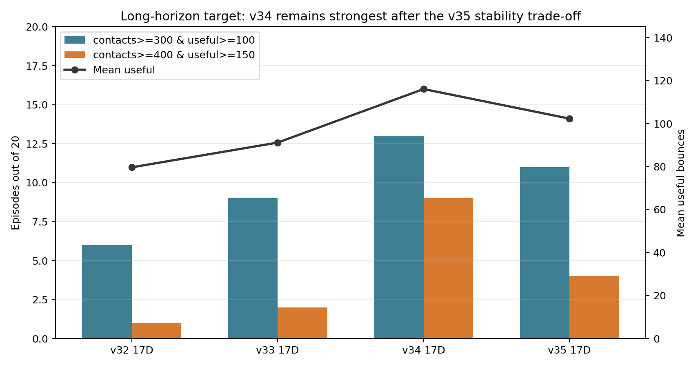

# v35 학습 완료 검토와 다음 개선 방향

작성일: 2026-06-05

## 한 줄 요약

`keep1_v35_17d_strong_axis_stable`은 v34에서 이어 학습한 17D 모델이며, body contact와 low-apex/floor 실패는 줄였다. 하지만 사용자가 목표로 잡은 장기 랠리 지표인 `contacts 300 / useful 100`과 `contacts 400 / useful 150`에서는 v34보다 약해졌다. 그래서 현재 배포/시연 주 모델은 v34를 유지하고, v35는 "안정성 reward를 강하게 주면 어떤 trade-off가 생기는가"를 보여주는 실험으로 쓰는 편이 좋다.

## 학습 완료 확인

원본 파일:

- model: `artifacts/ppo_runs/keep1_v35_17d_strong_axis_stable/keep1_v35_17d_strong_axis_stable_model.zip`
- training summary: `artifacts/ppo_runs/keep1_v35_17d_strong_axis_stable/keep1_v35_17d_strong_axis_stable_training_summary.json`
- long analysis summary: `artifacts/ppo_runs/keep1_v35_17d_strong_axis_stable/analysis/keep1_v35_17d_strong_axis_stable_long7200_eval20_summary.json`

학습 조건:

| 항목 | 값 |
| --- | ---: |
| resume source | `keep1_v34_17d_long_xyz012_model.zip` |
| completed timesteps | `1,000,000` |
| reset XY | `0.12m` |
| reset height | `[0.22, 0.52]m` |
| reset velocity XY | `0.035` |
| reset velocity Z | `[-0.12, 0.04]` |
| learning rate | `3e-6` |
| n epochs | `1` |
| clip range | `0.02` |
| low-apex grace | `6` |
| stable cycle reward cap | `30` |

v35에서 강화한 쪽:

- next-intercept XY error penalty: `1.6`
- post-contact lateral velocity penalty: `1.1`
- racket outward velocity penalty: `1.05`
- contact lateral stability reward: `0.65`
- easy-next-ball reward: `1.15`
- body clearance controller gain: `0.95`

## Training summary 기준 결과

100 episode evaluation에서는 v35가 v34보다 약간 좋아 보인다.

| 모델 | mean useful | max useful | 30+ rate | low-apex | body | floor | ball out | ball speed |
| --- | ---: | ---: | ---: | ---: | ---: | ---: | ---: | ---: |
| v34 | `101.67` | `175` | `0.79` | `4` | `10` | `3` | `32` | `2` |
| v35 | `104.80` | `171` | `0.82` | `2` | `7` | `1` | `32` | `8` |

해석:

- low-apex/body/floor는 줄었다.
- mean useful과 30+ rate는 소폭 상승했다.
- 하지만 ball speed limit이 `2 -> 8`로 늘었다.

이 지표만 보면 v35가 좋아 보이지만, 최종 목표는 단순 30+가 아니라 긴 horizon에서 `contacts 300 / useful 100`을 반복적으로 넘기는 것이다. 그래서 long analysis가 더 중요하다.

## 7200-step long analysis 기준 결과

20 episode 기준:

| 모델 | mean contacts | mean useful | max contacts | max useful | contacts>=300 & useful>=100 | contacts>=400 & useful>=150 |
| --- | ---: | ---: | ---: | ---: | ---: | ---: |
| v34 | `318.55` | `116.05` | `426` | `170` | `13/20` | `9/20` |
| v35 | `278.05` | `102.30` | `414` | `169` | `11/20` | `4/20` |

failure mode:

| 모델 | time limit | ball out | ball speed | robot body | floor | low-apex |
| --- | ---: | ---: | ---: | ---: | ---: | ---: |
| v34 | `11` | `5` | `1` | `3` | `0` | `0` |
| v35 | `10` | `6` | `2` | `1` | `1` | `0` |

해석:

- v35는 robot body contact를 `3 -> 1`로 줄였다.
- 하지만 long-horizon 목표 hit가 줄었다.
- 특히 `contacts>=400 & useful>=150`이 `9/20 -> 4/20`으로 떨어져서, 장기 랠리 모델로는 v34가 더 낫다.

추천 시각화:



## 왜 이런 trade-off가 생겼나

contact-level metric을 보면 v35는 공을 더 높이고 lateral stability term을 키웠지만, 다음 타격을 쉬운 상태로 만드는 점수는 떨어졌다.

| 지표 | v34 | v35 | 해석 |
| --- | ---: | ---: | --- |
| mean projected apex | `0.2417` | `0.2508` | v35가 더 높게 살림 |
| upward apex below 0.20 rate | `0.4648` | `0.4389` | 낮은 contact 비율 감소 |
| contact lateral stability term | `0.1730` | `0.2099` | lateral 안정성 보상은 작동 |
| next intercept reachable rate | `0.9334` | `0.9229` | 다음 타격 가능성은 하락 |
| mean next intercept XY error | `0.0201` | `0.0218` | 다음 타격 위치 오차 증가 |
| mean easy-next-ball score | `0.9949` | `0.9419` | 쉬운 다음 공 점수 하락 |
| applied action normalized norm | `0.3646` | `0.4128` | 더 공격적인 action 사용 |

결론:

- v35의 body clearance/lateral stability 강화는 의도대로 일부 안정성 문제를 줄였다.
- 하지만 reward가 lateral/body 쪽으로 강해지면서, long rally에서 더 중요한 next-intercept/easy-next-ball 품질이 약해졌다.
- 즉 “강하게 쓰이는 축을 더 강화”하는 방향은 가능하지만, 너무 세게 밀면 장기 랠리 최적점에서 벗어난다.

## 다음 개선 방향

바로 더 넓은 영역으로 확장하기보다, v34에서 v35의 장점만 약하게 가져오는 `v36 balanced`가 좋다.

목표:

- v34의 long-horizon 성능 유지
- v35에서 좋아진 body clearance 일부 반영
- ball speed limit 증가 방지
- next-intercept/easy-next-ball 품질 회복

권장 설정:

| 항목 | v35 | v36 후보 |
| --- | ---: | ---: |
| next-intercept XY penalty | `1.6` | `1.5` |
| post-contact lateral velocity penalty | `1.1` | `1.05` |
| racket outward velocity penalty | `1.05` | `0.95` |
| lateral stability reward | `0.65` | `0.60` |
| easy-next-ball reward | `1.15` | `1.05` |
| body clearance gain | `0.95` | `0.85` |
| learning rate | `3e-6` | `2e-6` |
| total timesteps | `1,000,000` | `800,000` |

권장 학습 명령:

```bash
PYTHONPATH=src python -u scripts/run_ppo_learning.py \
  --config-file configs/keep1_v32_17d_transfer.json \
  --set run_version=v36_17d_balanced_xyz012 \
  --set resume_from=artifacts/ppo_runs/keep1_v34_17d_long_xyz012/keep1_v34_17d_long_xyz012_model.zip \
  --set total_timesteps=800000 \
  --set reset_xy_range=0.12 \
  --set reset_xy_curriculum_enabled=false \
  --set reset_ball_height_bounds='[0.22,0.52]' \
  --set reset_velocity_xy_range=0.035 \
  --set reset_velocity_z_range='[-0.12,0.04]' \
  --set low_apex_contact_grace_count=6 \
  --set stable_cycle_reward_cap=30 \
  --set next_intercept_xy_error_penalty_weight=1.5 \
  --set post_contact_lateral_velocity_penalty_weight=1.05 \
  --set contact_racket_outward_velocity_penalty_weight=0.95 \
  --set contact_lateral_stability_reward_weight=0.60 \
  --set easy_next_ball_reward_weight=1.05 \
  --set controller_body_clearance_gain=0.85 \
  --set controller_body_clearance_margin=0.15 \
  --set controller_body_clearance_vertical_margin=0.33 \
  --set controller_body_clearance_max_step=0.020 \
  --set learning_rate=2e-6 \
  --set n_epochs=1 \
  --set clip_range=0.02 \
  --set eval_episodes=100 \
  --set evaluation_step_limit=7200 \
  --set bootstrap_heuristic_episodes=0 \
  --set bootstrap_epochs=0 \
  --set bootstrap_followup_epochs=0
```

평가 명령:

```bash
PYTHONPATH=src python -u scripts/run_ppo_rebound_analysis.py \
  --model-path artifacts/ppo_runs/keep1_v36_17d_balanced_xyz012/keep1_v36_17d_balanced_xyz012_model.zip \
  --episodes 20 \
  --seed 231 \
  --episode-step-limit 7200 \
  --analysis-name keep1_v36_17d_balanced_xyz012_long7200_eval20
```

성공 기준:

- `contacts>=300 & useful>=100`: v34의 `13/20` 이상
- `contacts>=400 & useful>=150`: v34의 `9/20`에 근접하거나 초과
- robot body contact: v35처럼 `1/20` 근처
- ball speed limit: v34처럼 `1/20` 근처

## 발표에서 쓰는 법

v35는 최종 성능 모델이라기보다 실패 모드 trade-off 설명에 좋다.

발표 문장:

> v35에서는 강하게 쓰이는 stability/body-clearance 축을 더 밀어봤습니다. 그 결과 body contact는 줄었지만, 장기 랠리에서는 다음 타격 가능한 위치로 보내는 품질이 떨어져 v34보다 목표 달성률이 낮아졌습니다. 그래서 최종 선택은 단순 최고 reward가 아니라, long-horizon 평가 기준에 맞춰 판단했습니다.
