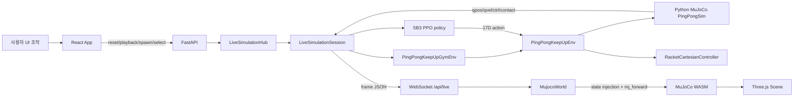
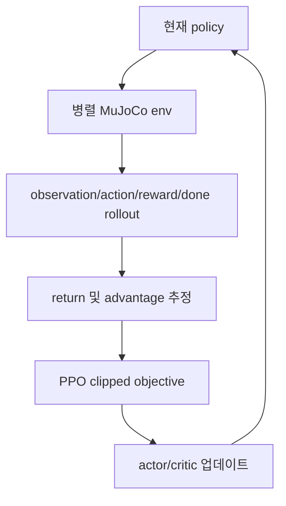

# 발표 준비 통합 정리

기준 시점: 2026-06-06

기준 커밋: `fad0598 fix: Update shared session note wording for clarity`

현재 작업 트리 참고: `original.png`가 untracked 상태로 존재하지만, 이 정리에서는 사용하지 않았다.

추가 모델 검토: `docs/model-review-13d-17d.md`에 13D 종료 원인, 17D action 차원 분석, 프로젝트 리스크를 별도로 정리했다.

## 한 문장 요약

이 프로젝트는 Franka Panda 로봇팔에 탁구채를 붙인 MuJoCo 환경에서 Stable-Baselines3 PPO로 학습한 policy를 서버에서 실행하고, 브라우저는 서버가 보낸 물리 상태를 MuJoCo WASM과 Three.js로 실시간 시각화하는 Ping-Pong Keep-Up 데모다.

발표에서 가장 중요한 메시지는 세 가지다.

1. 학습된 것은 물리 엔진이나 로봇 모델이 아니라, observation을 residual action으로 바꾸는 PPO policy network다.
2. policy는 로봇 관절 토크를 직접 출력하지 않고, 라켓의 목표 위치, 기울기, 속도, 접촉 프레임 계획을 보정한다.
3. 웹은 녹화 재생이 아니라 서버의 실제 MuJoCo/PPO loop 상태를 받아 렌더링한다.

## 발표 흐름 추천

1. 문제 정의: 로봇팔이 탁구공을 계속 받아 올리는 keep-up 문제
2. 환경 구성: MuJoCo, Franka Panda, 라켓, 공, 접촉 판정
3. MDP 정의: 55D observation, 17D action, reward, episode 종료
4. 학습 방식: PPO, ActorCriticPolicy, rollout 기반 학습, v39 설정과 평가 결과
5. 웹 런타임: 서버 authoritative simulation, 브라우저 visualization runtime
6. 구현 과정: git 흐름으로 본 발전 단계
7. 시각화: 현재 UI와 추가 발표 자료 후보
8. 한계와 개선: 학습 스크립트 재현성, reward/action 시각화 확장, per-client session

## Git 작업 흐름

전체 git 흐름은 2026-06-04에 초기 앱/시뮬레이터/문서 구조를 만들고, 2026-06-05에 실제 v39 모델, 모델 선택, shared live session, 배포 안정화, UI polish를 얹은 순서다.

### 1단계: 초기 저장소와 프론트엔드 기반

대표 커밋:

- `0bfeb7c Initial commit`
- `be4145a feat: initialize frontend project with TypeScript, Vite, and React setup`
- `3b84924 feat: add backend and frontend structure with initial configurations and documentation`
- `b4288ed Add favicon and Vite environment type declarations`

이 단계에서는 README, Vite/React/TypeScript 프론트엔드, 초기 MuJoCo asset, policy asset, 기본 문서, Docker/deploy 메모가 들어왔다. 처음에는 프론트엔드 중심의 데모 구조와 문서 skeleton이 먼저 자리 잡았다.

### 2단계: 웹 3D 뷰어와 MuJoCo 자산 정리

대표 커밋:

- `5f79623 Refactor code structure for improved readability and maintainability`
- `6a537ad Refactor demo UI and enhance simulation performance`
- `f15de73 feat: add RacketCartesianController for controlling racket position and orientation in simulation`
- `1a089d6 feat: implement documentation page and update app routing for improved navigation`
- `3bda042 feat: add mujoco model compilation script and update asset manifest for new scene format`
- `01eccc9 Delete outdated MuJoCo model and scene files...`

이 시점에는 브라우저에서 MuJoCo WASM scene을 열고 Three.js로 로봇/공/라켓을 그리는 구조가 강화됐다. XML/mesh source asset을 그대로 다루는 대신 `pingpong_scene.mjb` compiled scene을 만들고, fallback으로 runtime source asset을 열 수 있게 했다. 문서 페이지도 React 앱 안에 들어왔다.

### 3단계: RL 환경과 backend runtime 도입

대표 커밋:

- `f2b0db8 Refactor simulation and rollout handling`
- `a3cbb5b Add PingPongSim environment and training utilities`
- `beeac5e fix: add documentation URL parameters to FastAPI instance initialization`
- `433d8dc feat: Enhance simulation controls and loading experience`

여기서 핵심 변화는 vendored `pingpong_rl2` 환경이 들어온 것이다. `PingPongSim`, `PingPongKeepUpEnv`, Gymnasium wrapper, SB3 vector env adapter, controller가 현재 강화학습/런타임 이해의 중심이다.

### 4단계: 공 시작 조건 제어와 배포 준비

대표 커밋:

- `471634b feat: Implement ball spawning functionality and update related controls`
- `191523c feat: Update ball spawning functionality and enhance controls`
- `1edd1ce fix: Refactor ball spawning logic and improve initialization parameters`
- `8fdd61d feat: Add deployment workflow for automated server updates`
- `9b7fbb4`, `e7559a9`, `73850e4` deploy workflow 수정

공을 라켓 기준 offset/velocity로 다시 spawn하는 기능이 들어왔다. 이후 GitHub Actions self-hosted deploy, Docker build, server checklist가 정리됐다.

### 5단계: 문서와 카메라/로딩 UX 정리

대표 커밋:

- `75b7991 fix: Refactor trail handling in ThreeScene for improved performance and memory management`
- `9a72aad`, `cc3a61b`, `eaed48e`, `cd53141`, `0197a17` camera debug/free view 조정
- `580a6c4 Refactor documentation and improve simulation environment`
- `1e8f8cf feat: Implement loading progress tracking and enhance loading overlay UI`
- `04ab616 refactor: Enhance DocsPage layout and styling...`

이 단계에서는 실시간 시각화 안정성, trail memory, loading overlay, 문서 UX가 좋아졌다. 발표 시 현재 UI의 camera, trail, target band, contact marker 기능은 여기서 나온 흐름으로 설명할 수 있다.

### 6단계: v39 모델 경로와 preflight 안정화

대표 커밋:

- `4e21875 fix: Update model path to keep_v39_17d and adjust related documentation`
- `390b200 feat: Add preflight script for runtime asset checks and update deployment procedures`
- `6d9ace3 feat: Enhance ball spawn configuration and validation`
- `3e5e1ba docs: improve RL concept documentation`

기본 모델이 `keep_v39_17d`로 바뀌고, `.env`, Dockerfile, preflight가 모델 zip, scene XML, vendored RL package, Franka asset 존재 여부를 검사하게 됐다. ball spawn range는 training summary/env kwargs에서 계산하고 frontend/backend 양쪽에서 clamp한다.

### 7단계: 모델 catalog, action dimension UI, shared live session

대표 커밋:

- `c807c4e feat: Enhance loading UX with refresh button and model selection capabilities`
- `0d35358 Refactor and enhance Ping-Pong Keep-Up simulation`
- `fc6695d feat: Implement caching for static assets...`
- `2de7d76 feat: Introduce LiveSimulationHub for improved session management and WebSocket handling`
- `0f0eeff Enhance simulation environment and UI features`
- `c12e67f`, `2fdc85d`, `44a0872`, `fe67c3a` 모델 선택/호환성/action dimension UI 개선

이 단계에서 현재 서비스 구조가 완성됐다. 서버는 `rl/artifacts` 아래 대표 모델들을 catalog로 만들고, action dimension별 모델을 UI에 노출한다. `LiveSimulationHub`가 하나의 shared session을 실행하며 모든 WebSocket 구독자에게 최신 frame을 전달한다.

### 8단계: 최종 UI polish

대표 커밋:

- `83bcfd3 feat: Update App component to hide Docs link temporarily and add shared session note...`
- `fad0598 fix: Update shared session note wording for clarity`

현재 앱은 Docs 링크를 임시로 숨기고, shared server session이라는 점을 UI에 표시한다. 발표에서는 "한 사용자의 reset/model select/spawn 조작이 같은 데모를 보는 모든 사용자에게 적용된다"고 말하면 된다.

## 저장소 구조

| 경로 | 역할 |
| --- | --- |
| `README.md` | 프로젝트 목적, 실행, 배포, runtime asset 준비 방법 |
| `.env.example` | 포트, 기본 모델 path, deterministic policy, seed, scene path 설정 예시 |
| `docker-compose.yml` | `pingpong-web` 서비스, build args, port/environment |
| `.github/workflows/deploy.yml` | self-hosted runner에서 fetch/reset, preflight, docker build/up |
| `backend/` | FastAPI 서버와 vendored RL package |
| `backend/app/` | API, live simulation hub, 모델 catalog, 설정, ball spawn validation |
| `backend/vendor/pingpong_rl2/` | MuJoCo 환경, controller, Gym wrapper, SB3 vector env adapter |
| `frontend/` | React UI, MuJoCo WASM loader, Three.js renderer |
| `frontend/public/assets/mujoco/` | browser용 compiled MJB와 asset manifest |
| `frontend/public/docs/` | 웹 DocsPage가 fetch하는 문서 복사본 |
| `docs/` | 발표/설명용 원본 문서 |
| `deploy/` | 서버 preflight/update/checklist/proxy notes |
| `rl/assets/` | runtime MuJoCo source scene, Panda XML/mesh asset |
| `rl/artifacts/` | PPO model zip, training summary, monitor CSV, analysis CSV/JSON |

`rl/`은 용량이 크고 환경 의존성이 있어 git tracked file 목록에는 포함되지 않지만, 실제 실행과 발표 분석에는 중요하다. 현재 `rl` 디렉토리는 약 2.9GB이고, `rl/artifacts/keep_v39_17d`는 약 49MB다.

## 전체 런타임 구조



### 서버가 authoritative인 이유

서버는 실제 PPO policy와 Python MuJoCo 환경을 실행한다. 매 제어 step마다 서버가 다음 일을 한다.

1. 환경에서 observation 생성
2. `PPO.predict(observation, deterministic=True)` 호출
3. action을 환경에 적용
4. controller가 라켓 목표를 joint target으로 변환
5. Python MuJoCo가 substep 적분
6. reward, contact, failure, qpos/qvel/ctrl 추출
7. frame payload를 WebSocket으로 publish

브라우저는 policy를 실행하지 않는다. 브라우저의 MuJoCo WASM은 서버 frame의 `qpos`, `qvel`, `ctrl`을 받아 geometry pose를 맞추는 용도다.

### Shared live session

초기 구조는 클라이언트마다 세션을 만들 수 있었지만, 현재 구조는 shared live session이다.

```text
shared MuJoCo env -> shared PPO predict -> latest frame
                                      -> client A
                                      -> client B
                                      -> client C
```

장점은 서버 CPU 사용량이 접속자 수에 거의 비례하지 않는다는 것이다. 단점은 모델 선택, reset, spawn, playback이 모든 viewer에게 공유된다는 점이다.

## 강화학습 문제 정의

### MDP 대응

| MDP 용어 | 이 프로젝트에서의 의미 |
| --- | --- |
| State | MuJoCo 내부 전체 물리 상태, 즉 `qpos`, `qvel`, contact, body/site pose 등 |
| Observation | policy에 전달하는 feature vector. 현재 기본 모델은 55D |
| Action | policy가 출력하는 residual control. 현재 기본 모델은 17D |
| Transition | action 적용 후 controller와 MuJoCo substep이 만든 다음 물리 상태 |
| Reward | keep-up에 도움이 된 정도를 나타내는 여러 reward term의 합 |
| Episode | 공을 계속 받아 올리는 한 번의 시도. 실패 조건이나 step limit으로 종료 |
| Policy | observation을 action으로 바꾸는 ActorCriticPolicy의 actor 경로 |

### Observation 55D

`PingPongKeepUpEnv.observation()`이 만든다. 구성은 다음과 같다.

| 구성 | 차원 | 의미 |
| --- | ---: | --- |
| Joint positions | 7 | Franka Panda arm 7개 관절 각도 |
| Joint velocities | 7 | 7개 관절 속도 |
| Racket position | 3 | 라켓 중심 월드 좌표 |
| Racket velocity | 3 | 라켓 중심 Cartesian velocity |
| Target position | 3 | 내부 controller 목표 위치 |
| Ball position | 3 | 공 월드 좌표 |
| Ball velocity | 3 | 공 선속도 |
| Ball relative position | 3 | 라켓 기준 공 위치 |
| Predicted intercept relative XY | 2 | 현재 궤적으로 예상한 접촉 지점의 수평 offset |
| Predicted intercept time | 1 | 예상 접촉까지의 시간 |
| Task phase one-hot | 4 | prepare, strike, return shaping, recovery |
| Contact context | 2 | 최근 접촉 이후 시간, 성공 접촉 count 요약 |
| Next intercept metrics | 6 | 다음 접촉 위치/시간/도달 가능성/회복 거리/준비도 |
| Desired outgoing velocity | 3 | 접촉 후 공이 가져야 할 목표 속도 |
| Racket face normal | 3 | 라켓 면 방향 |
| Target tilt | 2 | 목표 라켓 기울기 |
| Total | 55 | 기본 v39 policy 입력 |

legacy 26D/29D policy는 최신 observation 전체를 그대로 받지 않는다. 서버의 `legacy_policy_observation()`이 최신 observation에서 예전 policy가 학습한 field만 추려 넣는다.

### Action 17D

현재 기본 action mode:

```text
position_contact_frame_velocity_tilt_lateral_apex_tracking_residual
```

17개 action은 관절 토크가 아니라 접촉 프레임 기준 residual이다.

| 구성 | 차원 | 코드상 의미 |
| --- | ---: | --- |
| Contact-frame position residual | 3 | radial, tangent, strike z |
| Tilt residual | 2 | pitch/roll 기울기 보정 |
| Velocity residual | 3 | velocity scale, outgoing x/y 보정 |
| Vertical velocity / tilt scale residual | 3 | racket vz, trajectory tilt scale, centering tilt scale |
| Lateral velocity residual | 2 | racket vx/vy residual |
| Apex timing residual | 2 | target apex z, strike plane z |
| Tracking residual | 2 | tracking vx/vy residual |
| Total | 17 | policy output |

Residual action을 쓰는 이유는 학습 난도를 낮추기 위해서다. 기본 controller/planner가 "대체로 그럴듯한 라켓 목표"를 만들고, policy는 상황에 맞게 미세 조정한다.

### Step 처리 순서

`PingPongKeepUpEnv.step()`의 흐름이다.

1. action shape가 `action_size`와 맞는지 검사
2. action을 `action_low/action_high` 범위로 clip
3. action mode에 따라 residual slice를 내부 변수에 저장
4. contact-frame planner 또는 strike target 함수로 라켓 목표 위치 계산
5. target tilt, target velocity, body clearance reference 설정
6. `RacketCartesianController.compute_joint_targets()` 호출
7. `PingPongSim.step_with_contact_trace()`로 MuJoCo substep 진행
8. contact event, failure reason, success reason 계산
9. reward terms 계산 후 합산
10. termination/truncation 판단
11. 다음 observation과 info 반환

### Episode 종료 조건

주요 failure reason은 다음과 같다.

| 조건 | 코드상 처리 |
| --- | --- |
| floor contact | 공이 `floor`와 접촉하면 실패 |
| robot body contact | 공이 라켓이 아닌 로봇 body와 닿으면 실패 |
| ball out of bounds | x/y/z 유효 범위를 벗어나면 실패 |
| nonfinite state | qpos/qvel에 비정상 값이 있으면 실패 |
| ball speed limit | 공 속도가 너무 크면 실패 |
| low apex contact 반복 | 목표 높이에 못 미치는 접촉이 grace count를 넘으면 실패 |
| max episode steps | 훈련/평가 설정에 따라 time limit |

live demo에서는 server runtime에서 `max_episode_steps=0`으로 넣고, 환경 내부에서 0 이하 값은 unlimited로 해석된다. 따라서 실패 조건이 발생하지 않는 한 step limit으로 자동 reset되지 않는다.

## 환경 세팅

### MuJoCo scene

주요 파일:

- `rl/assets/scene.xml`
- `rl/assets/franka/panda.xml`
- `frontend/public/assets/mujoco/pingpong_scene.mjb`
- `frontend/public/assets/mujoco/asset-manifest.json`

`scene.xml`은 Panda 모델을 include하고, timestep과 중력, 바닥, 공을 정의한다.

핵심 값:

| 항목 | 값 |
| --- | ---: |
| MuJoCo timestep | 0.002s |
| control dt | 0.02s |
| substeps per control step | 10 |
| 중력 | `0 0 -9.81` |
| 공 반지름 | 0.02m |
| 공 질량 | 0.0027kg |
| 라켓 head 반지름 | 0.084m |
| 라켓 head half-depth | 0.006m |

`panda.xml`에서 라켓은 Panda hand 아래 `racket` body에 붙어 있다. `racket_head`가 실제 충돌 geom이고, `racket_head_back`, rim, handle은 주로 시각 표시용이다. `racket_center` site가 관측과 제어 기준점이다.

### 좌표 변환

MuJoCo는 Z-up, Three.js는 Y-up이다. 프론트엔드 렌더러는 위치를 다음처럼 바꾼다.

```text
MuJoCo (x, y, z) -> Three.js (x, z, -y)
```

`mujocoModelScene.ts`의 `mujocoToThree`, `setThreePosition`, `setThreeQuaternion`이 이 변환을 담당한다.

### 공 시작 조건

공은 절대 좌표가 아니라 라켓 기준 offset으로 놓는다.

현재 v39 학습 분포:

| 항목 | 범위 |
| --- | --- |
| XY offset | 라켓 기준 반경 0.13m disk sampling |
| 공 시작 높이 | 0.22m ~ 0.52m |
| X/Y 초기 속도 | -0.045m/s ~ +0.045m/s |
| Z 초기 속도 | -0.14m/s ~ +0.04m/s |

웹 UI와 backend 모두 이 범위를 기준으로 clamp한다. `keep_v39_17d`는 실제 테스트 범위를 더 넓게 열어둔 축도 있다.

## 학습과 모델

### 중요한 구분

PPO는 학습 알고리즘이고, 실제 제어기는 PPO로 학습된 policy network다. 웹에서 매 step 사용하는 것은 `ActorCriticPolicy`의 actor 출력이다. critic은 학습 중 value estimation과 PPO update에 쓰인다.

### 현재 저장소에 들어 있는 것과 없는 것

현재 저장소에는 PPO 환경과 runtime 재사용 코드가 들어 있다.

- 있음: MuJoCo 환경, Gymnasium wrapper, SB3 vector env adapter, PPO zip runtime loader, training summary, analysis CSV/JSON
- 없음: `PPO.learn(...)`을 직접 호출하는 학습 실행 스크립트

`docs/policy-and-training.md`에는 과거 학습 command 예시가 있고, `rl/artifacts/keep_v39_17d/keep_v39_17d_training_summary.json`에는 실제 v39 학습 설정과 결과가 남아 있다.

### PPO 학습 루프

개념적으로는 다음 순서다.



`backend/vendor/pingpong_rl2/src/pingpong_rl2/training/vector_env.py`는 Gymnasium vector env를 Stable-Baselines3 `VecEnv` 형식으로 맞춘다. `make_sb3_async_vector_env()`가 env를 여러 개 만들고, `SB3AsyncVectorEnvAdapter`가 reset/step/info 형식을 SB3가 기대하는 형태로 변환한다.

### v39 학습 카드

| 항목 | 값 |
| --- | --- |
| Run name | `keep_v39_17d` |
| Training mode | resume |
| Starting model | `keep1_v36_17d_balanced_xyz012_model.zip` |
| Completed timesteps | 700,000 |
| Algorithm | PPO |
| Library | Stable-Baselines3 2.8.0 |
| Observation | 55D |
| Action | 17D |
| n_envs | 4 |
| n_steps | 512 |
| batch size | 512 |
| learning rate | 8e-7 |
| gamma | 0.99 |
| GAE lambda | summary에 명시 안 됨. 별도 override가 없었다면 SB3 기본값 0.95 |
| PPO epochs | 1 |
| clip range | 0.01 |
| seed | 7 |

이 설정은 보수적인 fine-tuning에 가깝다. learning rate와 clip range가 작고, 이전 v36 계열 checkpoint에서 이어 학습했다.

### Policy network 구조

문서와 SB3 metadata 기준 구조:

```text
Observation (55)
  |
  +-- Actor / policy path
  |     Linear(55 -> 64) + Tanh
  |     Linear(64 -> 64) + Tanh
  |     Linear(64 -> 17) = action mean
  |     log_std(17)
  |
  +-- Critic / value path
        Linear(55 -> 64) + Tanh
        Linear(64 -> 64) + Tanh
        Linear(64 -> 1) = state value
```

live runtime은 `PPO.load(..., device="cpu")`로 모델을 읽고, `deterministic=True` 설정으로 action을 얻는다.

### 평가 결과

`keep_v39_17d_training_summary.json`의 100 episode evaluation:

| 지표 | 값 |
| --- | ---: |
| Mean return | 1076.64 |
| Mean useful bounces | 119.52 |
| Max useful bounces | 181 |
| Mean stable cycles | 119.52 |
| Max stable cycles | 181 |
| 1+ useful bounce rate | 0.87 |
| 10+ useful bounce rate | 0.86 |
| 20+ useful bounce rate | 0.85 |
| 30+ useful bounce rate | 0.83 |

failure counts:

| Failure | Count |
| --- | ---: |
| time_limit | 63 |
| ball_out_of_bounds | 22 |
| robot_body_contact | 9 |
| floor_contact | 3 |
| ball_speed_limit | 2 |
| low_apex_contact | 1 |

추가 analysis summary 중 `keep1_v39_oldbase_long7200_eval20_summary.json`은 20 episode, 7200 step 평가에서 mean return 1198.02, mean useful bounces 130.95, max useful bounces 182를 기록했다.

## Reward 설계

보상은 `PingPongKeepUpEnv._reward_terms()`가 term별로 계산하고 합산한다. 핵심은 "공을 맞혔는가"가 아니라 "다음 공을 다시 칠 수 있는 형태로 되돌렸는가"다.

주요 보상:

| 항목 | 의미 |
| --- | --- |
| `tracking_term` | 공이 내려오는 동안 라켓이 예상 접촉 위치로 이동하도록 유도 |
| `contact_bonus` | useful contact가 발생했을 때 보상 |
| `apex_match_term` | 접촉 후 공이 목표 apex 높이에 가까워지도록 유도 |
| `return_target_xy_term` | 공이 중앙/return target 근처로 돌아오도록 유도 |
| `next_intercept_reachable_bonus` | 다음 접촉 지점이 도달 가능하면 보상 |
| `easy_next_ball_term` | 다음 공의 시간, 위치, 속도가 쉬운 상태이면 보상 |
| `trajectory_match_term` | 실제 outgoing velocity가 목표 velocity와 가까우면 보상 |
| `stable_contact_term` | 높이와 lateral 안정성을 만족하는 접촉 보상 |
| `stable_cycle_term` | 안정 접촉이 연속될수록 추가 보상 |

주요 패널티:

| 항목 | 의미 |
| --- | --- |
| `contact_frame_action_penalty` | residual action이 너무 큰 상황 억제 |
| `tilt_angle_penalty` | 과도한 라켓 기울기 억제 |
| `tilt_action_delta_penalty` | 기울기 급변 억제 |
| `next_intercept_xy_error_penalty` | 다음 접촉 위치가 target에서 벗어남 |
| `post_contact_lateral_velocity_penalty` | 접촉 후 공의 수평 속도가 너무 큼 |
| `contact_xy_error_penalty` | 라켓 중심에서 벗어난 접촉 |
| `contact_racket_lateral_velocity_penalty` | 접촉 순간 라켓 수평 속도 과다 |
| `contact_racket_outward_velocity_penalty` | 라켓이 공을 바깥으로 밀어내는 움직임 |
| `nonuseful_contact_penalty` | 맞긴 했지만 useful bounce가 아닌 접촉 |
| `failure_penalty` | floor/body/out-of-bounds 등 실패 |

`success_reason`은 `useful_keepup_bounce`가 대표적이다. 조건은 공의 upward velocity, 라켓의 upward velocity, contact XY alignment, projected apex height, next intercept reachability/easy score 등을 통과해야 한다.

## Backend 코드 요약

| 파일 | 다루는 내용 |
| --- | --- |
| `backend/app/main.py` | FastAPI 앱, CORS, cache header, `/api/health`, `/api/config`, `/api/models`, `/api/models/select`, `/api/live`, SPA/static serving |
| `backend/app/settings.py` | `.env`/환경변수 로딩, project root, model path, scene path, server port, deterministic flag, seed 검증 |
| `backend/app/ball_spawn.py` | 모델/env kwargs에서 ball spawn range 계산, v39 tested range 확장, frontend message clamp/parse |
| `backend/app/live_simulation.py` | PPO runtime load, shared `LiveSimulationHub`, WebSocket broadcast, session reset/spawn/step, frame payload 생성, policy shape validation |
| `backend/app/model_catalog.py` | `rl/artifacts` 모델 수집, SB3 zip metadata/summary 읽기, action labels, action dimension grouping, compatibility, UI metadata |
| `backend/app/__init__.py` | backend package marker |
| `backend/requirements.txt` | FastAPI, uvicorn, MuJoCo 3.8.0, NumPy, Gymnasium, Stable-Baselines3 고정 |
| `backend/Dockerfile` | frontend build stage, Python runtime stage, runtime asset existence check, uvicorn 실행 |

### `LiveSimulationHub` 핵심

- subscriber queue는 max size 3이다.
- 느린 클라이언트는 오래된 frame을 쌓지 않고 최신 frame 위주로 받는다.
- model select 실패 시 이전 runtime/session을 복구한다.
- WebSocket 종료 시 `WebSocketDisconnect`, `RuntimeError`, `OSError`를 정상 종료처럼 처리한다.

### Frame payload 핵심

브라우저로 보내는 frame에는 다음이 포함된다.

- episode, step, time
- reset/terminated/truncated
- reward
- failure/success reason 일부
- qpos, qvel, ctrl
- ball position/velocity
- racket position
- contact event/count/last contact
- action array
- model id

현재 frame에는 `reward_terms` 전체가 직접 포함되지는 않는다. reward term live visualization을 만들려면 backend frame payload에 `info["reward_terms"]`를 추가하고 frontend type/visualizer를 확장하면 된다.

## Vendored RL 코드 요약

| 파일 | 다루는 내용 |
| --- | --- |
| `backend/vendor/pingpong_rl2/pyproject.toml` | `pingpong-rl2` package metadata, dependencies |
| `pingpong_rl2/defaults.py` | default control dt, reward weights, PPO defaults, run name 후보 |
| `pingpong_rl2/envs/pingpong_sim.py` | MuJoCo model/data wrapper, ball spawn/reset, contact trace, failure reason |
| `pingpong_rl2/envs/keepup_env.py` | MDP 본체. observation/action/reward/reset/step/action modes/contact-frame planner/termination |
| `pingpong_rl2/envs/gym_env.py` | Gymnasium `Env` wrapper, observation/action spaces, reset/step adapter |
| `pingpong_rl2/training/vector_env.py` | Gymnasium vector env와 Stable-Baselines3 `VecEnv` adapter |
| `pingpong_rl2/controllers/ee_pose_controller.py` | 라켓 target pose/velocity를 7개 joint target으로 푸는 damped least squares Cartesian controller |
| `pingpong_rl2/controllers/heuristic_keepup.py` | strike-contract action mode용 heuristic policy. bootstrap/비교/디버깅 개념에 유용 |
| `pingpong_rl2/utils/ppo_runs.py` | run name, model path, training summary, env kwargs resolution |
| `pingpong_rl2/utils/paths.py` | package/artifact/asset path resolution |
| `__init__.py` 파일들 | package export |

### Controller 핵심

`RacketCartesianController.compute_joint_targets()`는 라켓 목표 위치와 면 방향 오차를 Jacobian 기반으로 joint delta로 바꾼다.

주요 특징:

- position error와 orientation error를 함께 사용
- target velocity feedforward/feedback 지원
- nullspace posture 유지 지원
- body clearance nullspace delta로 공과 로봇 link 충돌을 줄임
- joint limit으로 최종 target clip

이 덕분에 policy가 직접 7개 관절 또는 torque를 제어하지 않아도 된다.

## Frontend 코드 요약

| 파일 | 다루는 내용 |
| --- | --- |
| `frontend/src/main.tsx` | React app mount |
| `frontend/src/app/App.tsx` | 전체 UI state, model select, loading overlay, panels, controls wiring |
| `frontend/src/app/DocsPage.tsx` | public docs markdown fetch와 docs layout |
| `frontend/src/app/MarkdownDocument.tsx` | 간단한 markdown parser/renderer |
| `frontend/src/components/SimulationCanvas.tsx` | React lifecycle와 `DemoController` 연결 |
| `frontend/src/components/ActionVisualizer.tsx` | policy output action bar 시각화 |
| `frontend/src/controls/PlaybackControls.tsx` | play/pause/reset |
| `frontend/src/controls/BallControls.tsx` | ball start offset/velocity slider 및 number input |
| `frontend/src/controls/CameraControls.tsx` | free/north/south/east/west/top/four camera |
| `frontend/src/controls/ModelControls.tsx` | action dimension별 model 선택 UI |
| `frontend/src/controls/VisualizationToggles.tsx` | trail, target band, contact marker toggle |
| `frontend/src/simulation/demoController.ts` | MuJoCo world 초기화, render loop, snapshot emit/progress |
| `frontend/src/simulation/mujocoWorld.ts` | MuJoCo WASM scene load, WebSocket 연결, server frame 적용, snapshot 생성 |
| `frontend/src/simulation/assetLoader.ts` | asset manifest fetch, asset byte cache, concurrent asset download |
| `frontend/src/simulation/mujocoLoader.ts` | `@mujoco/mujoco` WASM module singleton loader |
| `frontend/src/simulation/ballSpawnConfig.ts` | ball spawn config parsing/clamping, disk radius clamp |
| `frontend/src/simulation/modelConfig.ts` | `/api/models` payload parsing |
| `frontend/src/simulation/types.ts` | UI/runtime type 정의와 default snapshot/config |
| `frontend/src/visualization/ThreeScene.ts` | Three.js scene, lights, cameras, trail, target band, contact markers |
| `frontend/src/visualization/mujocoModelScene.ts` | MuJoCo model geometry/material/texture를 Three.js mesh로 변환 |
| `frontend/src/styles/global.css` | 전체 UI layout, panels, docs, loading, controls style |
| `frontend/scripts/compile-mujoco-model.mjs` | `rl/assets/scene.xml`을 browser용 `pingpong_scene.mjb`로 compile하고 manifest 갱신 |
| `frontend/package.json` | React 19, Three.js, MuJoCo WASM, Vite, TypeScript scripts/deps |
| `frontend/vite.config.ts` | Vite build config |
| `frontend/tsconfig*.json` | TypeScript project config |
| `frontend/index.html` | Vite HTML entry |
| `frontend/public/favicon.svg` | favicon |

### 현재 UI에서 이미 가능한 시각화

- 3D 로봇/라켓/공 실시간 렌더링
- ball trail
- target height band
- contact marker
- action bar by policy output
- action dimension/model selector
- height/contact/time/controller metrics
- free/top/cardinal/four-camera views
- loading progress overlay

## Docs/Markdown 파일 요약

`docs/`는 원본 설명 문서이고, `frontend/public/docs/`는 웹 DocsPage가 fetch하는 복사본이다. 해시 비교 결과 `overview.md`만 원본과 public 버전이 다르고, 나머지는 동일하다.

| 파일 | 내용 |
| --- | --- |
| `README.md` | 프로젝트 목적, 구조, `.env`, 로컬 실행, Docker, MuJoCo asset compile, 서버 배포 |
| `docs/overview.md` | 프로젝트 개요, 핵심 개념, 무엇을 학습했는지, 실행 루프 |
| `frontend/public/docs/overview.md` | `docs/overview.md`보다 설명이 조금 더 친절함. "웹 탁구 게임이 아니라 관찰 도구"라는 설명과 문서 읽는 순서 포함 |
| `docs/mdp-formulation.md` | MDP 용어 대응, 55D observation, 17D action, 한 step 흐름, episode 종료 조건 |
| `docs/reward-function.md` | 보상 설계, contact 보상만으로 부족한 이유, 주요 보상/패널티, v39 방향 |
| `docs/simulation-environment.md` | MuJoCo scene, Panda/라켓/공 구성, 단위, timestep, 공 배치, 접촉/실패 판정, 웹 렌더링 |
| `docs/policy-and-training.md` | 현재 모델 `keep_v39_17d`, SB3 PPO zip 내용, network 구조, 학습 설정, 평가 요약, 모델 catalog/action 시각화 |
| `docs/runtime-architecture.md` | 서버/브라우저 역할 분리, shared live session, WebSocket 오류 처리, MJB loading, 모델 전환 비용, 홈서버 성능 추정 |
| `deploy/server-checklist.md` | Docker Compose 배포 조건, preflight, build/up, runtime asset 누락 대응 |
| `deploy/nginx-proxy-manager-notes.md` | Nginx Proxy Manager 설정, WebSocket, cache/compression |

## 배포와 실행

### 로컬 개발

프론트엔드:

```sh
cd frontend
npm install
npm run dev
```

서버:

```sh
python -m venv .venv
source .venv/bin/activate
pip install -r backend/requirements.txt
python -m uvicorn backend.app.main:app --host 0.0.0.0 --port 8079
```

Docker:

```sh
docker compose up -d --build
```

### 중요한 환경변수

| 변수 | 의미 |
| --- | --- |
| `PINGPONG_WEB_PORT` | host에 노출할 port. 기본 8079 |
| `PINGPONG_POLICY_MODEL_PATH` | 기본 PPO zip |
| `PINGPONG_POLICY_DETERMINISTIC` | deterministic policy inference 여부 |
| `PINGPONG_LIVE_SEED` | live session reset seed |
| `PINGPONG_RL_SOURCE_ROOT` | vendored RL package 위치 override |
| `PINGPONG_MUJOCO_SCENE_PATH` | 서버 Python MuJoCo scene path |
| `PINGPONG_MUJOCO_SOURCE_ROOT` | MJB compile source root |

### preflight

`deploy/preflight.sh`가 확인하는 것:

- policy model zip
- MuJoCo scene XML
- vendored RL package
- Franka asset directory
- browser용 compiled `pingpong_scene.mjb`

모델 zip 누락 로그에서 `.zip.zip`처럼 보일 수 있다. 이는 Stable-Baselines3가 후보 path에 `.zip`을 덧붙이기 때문이고, 실제 원인은 `.env`의 model path가 컨테이너/서버 안에 없다는 뜻이다.

## 발표 질의응답 예상

### Q. PPO가 정확히 무엇을 학습했나?

MuJoCo 물리나 로봇 모델을 학습한 것이 아니라, 55D observation을 17D residual action으로 바꾸는 actor network의 파라미터를 학습했다. Critic은 학습 중 value 추정을 돕고, live demo에서는 actor의 action이 직접 제어에 쓰인다.

### Q. 왜 관절 토크를 직접 출력하지 않았나?

직접 토크 제어는 action 의미가 너무 복잡하고 학습 난도가 높다. 이 프로젝트는 라켓 end-effector 목표를 만들고, policy는 그 목표를 residual로 보정한다. 관절 target 변환은 Jacobian 기반 Cartesian controller가 맡는다.

### Q. Contact-frame action mode가 왜 긴가?

action이 단순 XYZ가 아니라 접촉 좌표계의 radial/tangent/strike 높이, tilt, velocity, lateral, apex timing, tracking residual까지 포함하기 때문이다. 이름은 길지만 의미는 "기본 접촉 계획을 여러 관점에서 미세 조정한다"에 가깝다.

### Q. 성공 접촉은 단순히 공과 라켓이 닿는 것인가?

아니다. contact event가 있어도 공이 충분히 위로 올라가야 하고, 라켓 중심과 가까워야 하며, 다음 접촉이 도달 가능하고 쉬운 상태여야 useful keep-up bounce로 인정된다.

### Q. 브라우저에서도 MuJoCo를 쓰는데 서버 MuJoCo와 다른가?

서버 MuJoCo가 authoritative simulation이다. 브라우저 MuJoCo WASM은 같은 scene을 열어 서버가 보낸 `qpos/qvel/ctrl`을 적용하고 geometry pose를 맞추는 렌더링 보조 역할이다.

### Q. 모델을 바꾸면 모든 사용자에게 영향이 있나?

그렇다. 현재는 shared live session이라 한 사용자의 model select/reset/spawn/playback이 같은 서버 세션을 보는 모든 viewer에게 적용된다. 독립 세션을 원하면 per-client session pool 구조가 필요하다.

### Q. 현재 저장소만으로 학습을 완전히 재현할 수 있나?

환경 코드와 vector env adapter, training summary는 있지만, `PPO.learn(...)`을 호출하는 학습 실행 스크립트는 현재 저장소에 없다. 발표에서는 "데모/런타임 재사용 저장소이며, summary에 실제 학습 설정과 결과가 남아 있다"고 말하는 편이 정확하다.

### Q. v39 성능은 어떻게 말하면 되나?

100 episode evaluation에서 mean return 1076.64, mean useful bounces 119.52, max useful bounces 181이다. 단순 contact count보다 useful bounce와 stable cycle이 더 의미 있는 지표다.

### Q. 왜 MJB 파일을 쓰나?

브라우저 초기 로딩을 빠르게 하려고 XML과 mesh들을 매번 source로 열지 않고 MuJoCo binary model인 `pingpong_scene.mjb`를 먼저 연다. 실패하면 `/runtime-mujoco-assets`의 source XML/mesh fallback을 시도한다.

## 시각화 후보

### 이미 구현된 시각화

| 후보 | 현재 상태 | 발표에서 쓰는 방법 |
| --- | --- | --- |
| 3D live simulation | 구현됨 | 실제 데모 첫 화면 |
| Ball trail | 구현됨 | 공 궤적과 안정성 설명 |
| Target height band | 구현됨 | 목표 apex/높이 tolerance 설명 |
| Contact marker | 구현됨 | 유효 접촉 위치와 이벤트 설명 |
| Policy output action bars | 구현됨 | 17D action이 매 step 변하는 모습 설명 |
| Four-camera view | 구현됨 | top/side view로 궤적과 라켓 이동 설명 |
| Model action dimension selector | 구현됨 | 3D/5D/17D 계열 비교 설명 |
| Loading progress overlay | 구현됨 | MJB, policy runtime, model switch 비용 설명 |

### 코드 변경 없이 바로 만들 수 있는 발표 자료 후보

| 후보 | 데이터 소스 | 설명 |
| --- | --- | --- |
| v39 evaluation metric bar chart | `keep_v39_17d_training_summary.json` | mean return, useful bounces, stable cycles, rate 지표 표시 |
| failure reason pie/bar chart | `keep_v39_17d_training_summary.json` | time limit, out of bounds, body contact 등 실패 분포 |
| scenario별 useful bounce 비교 | `analysis/*_summary.json` | height/velocity/XY stress test별 mean useful bounces 비교 |
| long eval episode timeline | `analysis/*_episodes.csv` | episode별 return, steps, contacts, useful bounces |
| contact XY scatter/heatmap | `analysis/*_contacts.csv` | 접촉 위치가 라켓/target 주변에 얼마나 모이는지 |
| contact quality scatter | `analysis/*_contacts.csv` | projected apex height vs next intercept xy error |
| action component distribution | `analysis/*_contacts.csv` | 17개 action residual의 분포/범위 |
| reward term stacked bar | `analysis/*_contacts.csv` | stable/contact/apex/penalty term이 접촉마다 어떻게 기여하는지 |

### 약간의 코드 변경으로 만들 수 있는 live 시각화 후보

| 후보 | 필요한 변경 | 효과 |
| --- | --- | --- |
| live reward terms panel | backend frame에 `info["reward_terms"]` 포함, frontend type/UI 추가 | 보상 설계 설명이 매우 쉬워짐 |
| live phase indicator | frame에 `phase_name` 포함 | prepare/strike/recovery를 화면에 표시 |
| next intercept marker | frame에 next intercept x/y/time 포함 | policy가 다음 공을 어떻게 예측하는지 보여줌 |
| desired vs actual outgoing velocity arrow | contact trace 일부를 frame에 포함 | 타격 품질과 trajectory match 설명 |
| contact-frame basis arrows | target/contact frame 정보를 frame에 포함 | radial/tangent/strike action 의미 설명 |
| policy architecture diagram panel | `/api/models` metadata의 `policy.architecture` 표시 | 55D input -> hidden -> 17D output 설명 |

### 발표에 가장 추천하는 시각화 5개

1. MDP loop diagram: observation -> policy -> residual action -> controller -> MuJoCo -> reward
2. 55D observation/17D action 구성표: 입력과 출력이 무엇인지 한눈에 설명
3. v39 evaluation bar chart: useful bounce, stable cycle, failure distribution
4. contact scatter/heatmap: 공이 어디서 맞고 어디로 돌아오는지 보여줌
5. live action bars + ball trail: 실제 데모에서 policy output과 물리 결과를 동시에 보여줌

## 발표 슬라이드 초안

### Slide 1. 프로젝트 제목

Ping-Pong Keep-Up: PPO 기반 로봇 탁구 keep-up 시뮬레이션

핵심 한 줄: 학습된 policy가 Franka Panda 라켓 목표를 보정해 공을 계속 받아 올리는 실시간 웹 데모.

### Slide 2. 문제 정의

- 로봇팔이 공을 한 번 맞히는 것이 아니라 계속 받아 올려야 한다.
- 좋은 행동은 다음 공도 다시 칠 수 있는 위치와 속도로 만드는 것이다.
- 물리, 접촉, 로봇 제어가 모두 결합된 연속 제어 문제다.

### Slide 3. 시스템 구성

- 서버: Python MuJoCo, RL env, SB3 PPO policy
- 브라우저: React UI, MuJoCo WASM, Three.js renderer
- WebSocket: qpos/qvel/ctrl/action/contact frame 전달

### Slide 4. 환경 구성

- Franka Panda 7DOF arm
- hand 아래 라켓 body와 `racket_head`
- freejoint 공과 floor
- 0.02s control dt, 10 MuJoCo substeps

### Slide 5. MDP

- Observation: 55D
- Action: 17D residual
- Reward: tracking, contact, apex, next intercept, stable cycle, penalties
- Termination: floor/body/out-of-bounds/speed/low apex

### Slide 6. Residual action 설계

- 직접 torque가 아니라 라켓 목표 보정
- contact-frame 기반 radial/tangent/strike z
- tilt/velocity/apex/tracking residual
- controller가 joint target으로 변환

### Slide 7. PPO 학습

- rollout 기반 on-policy 학습
- ActorCriticPolicy
- v36에서 resume한 v39 fine-tuning
- conservative learning rate/clip range

### Slide 8. v39 결과

- mean return 1076.64
- mean useful bounces 119.52
- max useful bounces 181
- 30+ useful bounce rate 0.83

### Slide 9. 웹 데모

- shared live session
- model action dimension selector
- action visualizer
- ball spawn controls
- trail/target/contact/camera visualization

### Slide 10. 작업 흐름

- 초기 React/MuJoCo viewer
- RL environment vendoring
- ball spawn/runtime controls
- deployment/preflight
- model catalog/action dimension UI
- shared live session and polish

### Slide 11. 한계와 개선

- 현재 저장소에는 학습 실행 스크립트가 없음
- reward terms live panel 추가 가능
- per-client session 구조는 서버 비용 증가
- 더 다양한 domain randomization/평가 시각화 가능

## 파일별 발표 포인트

### 꼭 읽어야 하는 핵심 파일

1. `backend/vendor/pingpong_rl2/src/pingpong_rl2/envs/keepup_env.py`
   - observation/action/reward/termination/action mode 전부 들어 있다.
2. `backend/vendor/pingpong_rl2/src/pingpong_rl2/envs/pingpong_sim.py`
   - MuJoCo reset/spawn/contact/failure가 들어 있다.
3. `backend/vendor/pingpong_rl2/src/pingpong_rl2/controllers/ee_pose_controller.py`
   - 라켓 목표가 joint target으로 바뀌는 원리.
4. `backend/app/live_simulation.py`
   - PPO policy load, runtime session, WebSocket frame 생성.
5. `frontend/src/simulation/mujocoWorld.ts`
   - 브라우저가 서버 frame을 받아 MuJoCo WASM에 적용하는 방법.
6. `frontend/src/visualization/ThreeScene.ts`
   - 발표용 시각화 기능.
7. `rl/artifacts/keep_v39_17d/keep_v39_17d_training_summary.json`
   - v39 실제 학습 설정과 평가 결과.
8. `docs/policy-and-training.md`, `docs/mdp-formulation.md`, `docs/reward-function.md`
   - 발표 설명 문장으로 바로 쓰기 좋은 문서.

### 발표 전 체크리스트

- `docs/policy-and-training.md`의 v39 학습 카드 숫자 암기
- 55D observation 구성과 17D action 구성을 말로 설명할 수 있게 준비
- "PPO가 학습한 것"과 "MuJoCo가 계산한 것" 구분
- contact count와 useful bounce 차이 설명 준비
- shared session의 장단점 설명 준비
- `PPO.learn` 스크립트가 현재 repo에 없다는 사실을 정직하게 설명할 준비
- 시연할 때 ball trail, contact marker, action bars, 4-camera view를 켜는 순서 준비
