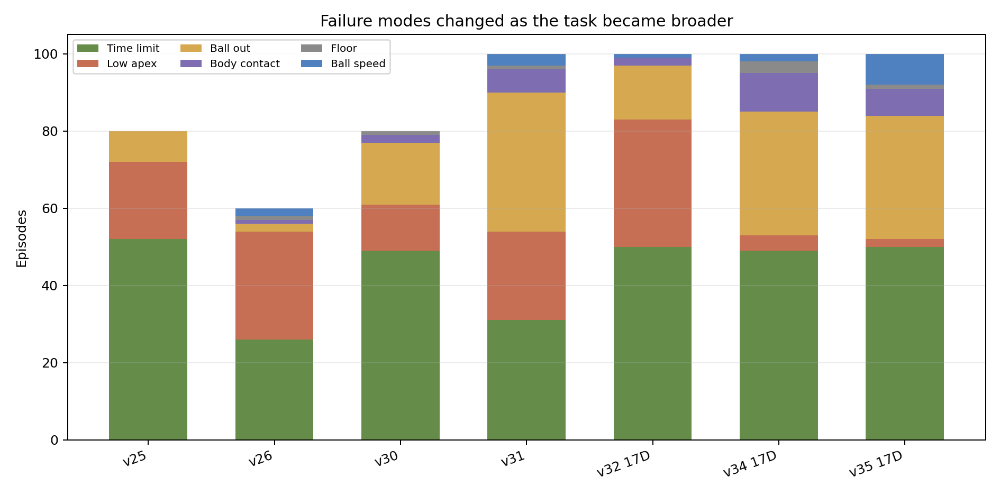
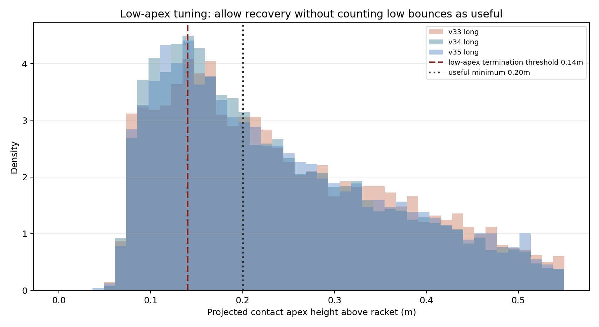
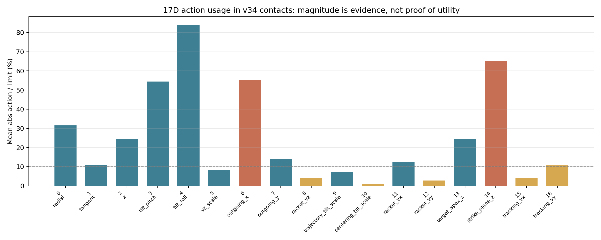
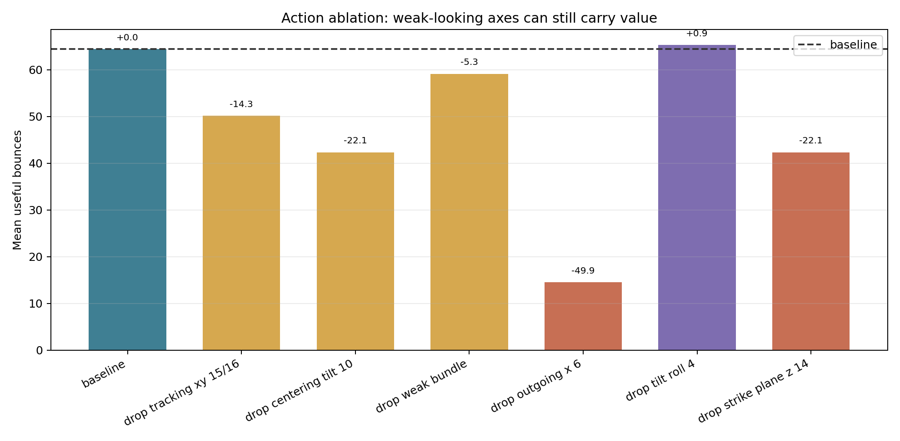

# 졸업작품 발표 초안

기준 자료:

- `desktop-자료/졸업작품계획서.md`
- `desktop-자료/PRESENTATION_PREP.md`
- `desktop-자료/presentation-prep.md`
- `desktop-자료/python_code_map.md`
- `pingpong_rl2/docs/rl_presentation_pack/*`
- `/Users/pilt/project-collection/pingpong/docs/*`

발표 기준 모델:

- 강화학습 코드: `/Users/pilt/project-collection/ros2/mujoco`
- 웹 서비스 코드: `/Users/pilt/project-collection/pingpong`
- 최종 모델: `pingpong_rl2/artifacts/ppo_runs/keep1_v39_17d_mid_curriculum_fixed`
- 발표용 이미지: `desktop-자료/presentation-images/`

---

## 0. 발표 전체 방향

### 발표 한 문장

본 졸업작품은 원래 ROS2/Gazebo 기반 로봇팔 제어 계획에서 출발해, 접촉 기반 로봇팔 강화학습에 더 적합한 MuJoCo 환경으로 전환하고, PPO로 학습한 탁구공 keep-up 정책을 웹 서비스에서 실시간으로 시각화한 프로젝트입니다.

### 발표에서 강조할 핵심

1. 단순히 "로봇팔이 공을 친다"가 아니라, 접촉 물리와 다음 공의 회복 가능성까지 고려한 강화학습 문제를 정의했다.
2. PPO policy가 로봇 관절 토크를 직접 내는 것이 아니라, controller가 만든 기본 타격 계획을 residual action으로 보정한다.
3. 결과를 영상으로만 보여준 것이 아니라, FastAPI 서버에서 실제 MuJoCo/PPO loop를 실행하고 웹에서 실시간으로 관찰할 수 있게 통합했다.
4. 최종 결과뿐 아니라, 실패 모드 분석, action/observation 확장, reset curriculum 등 시행착오와 검증 과정을 발표의 중심으로 둔다.

---

## 1. 목차 구성

목차는 1부터 15까지 길게 나열하지 않고, 아래 5개 덩어리로 보여준다.

1. 프로젝트 배경과 문제 정의
2. 시뮬레이션 환경과 시스템 설계
3. 강화학습 모델 설계와 학습 과정
4. 웹 서비스 구현과 결과
5. 한계, 기대효과, 배운 점

발표 슬라이드는 실제로는 12~13장 정도가 적당하다. 목차에는 큰 덩어리만 보여주고, 세부 내용은 각 파트 안에서 자연스럽게 풀어간다.

---

# 슬라이드 초안

## 1. 표지

### 슬라이드 제목

로봇팔 탁구공 Keep-Up 강화학습 시뮬레이션 및 웹 시각화

### 넣을 내용

- 이름, 학번, 학과
- 프로젝트 한 줄 설명
- MuJoCo 로봇팔/웹 데모 화면 캡처

### 발표 대본 초안

제가 진행한 프로젝트는 로봇팔 끝에 탁구채를 붙이고, MuJoCo 시뮬레이션 환경에서 강화학습으로 탁구공을 계속 받아 올리는 policy를 학습시킨 뒤, 그 결과를 웹에서 실시간으로 관찰하고 조작해 보면서 강화학습 결과를 직관적으로 이해할 수 있게 만든 시스템입니다.

처음 계획은 ROS2와 Gazebo를 이용한 로봇팔 원격조작 시스템이었지만, 진행 과정에서 접촉 기반 강화학습을 더 깊게 다루게 되면서 MuJoCo 기반의 학습 환경과 웹 시각화 서비스로 발전했습니다.

---

## 2. 목차

### 슬라이드 제목

발표 순서

### 넣을 내용

1. 프로젝트 배경과 문제 정의
2. 시뮬레이션 환경과 시스템 설계
3. 강화학습 모델 설계와 학습 과정
4. 웹 서비스 구현과 결과
5. 한계, 기대효과, 배운 점

### 발표 대본 초안

발표는 크게 다섯 부분으로 진행하겠습니다.

먼저 왜 로봇팔로 탁구공을 받아 올리는 문제를 선택했는지 설명하고, 그 다음 MuJoCo 시뮬레이션 환경과 전체 시스템 구조를 설명하겠습니다.

이후 강화학습 문제를 어떻게 정의했는지, PPO 모델을 어떤 방식으로 학습했는지 설명하고, 마지막으로 웹 서비스 구성과 결과, 한계와 배운 점을 정리하겠습니다.

---

# 1부. 프로젝트 배경과 문제 정의

<!-- ## 3. 개발 배경과 필요성

### 핵심 메시지

로봇팔 제어는 단순 위치 이동보다, 물체와 접촉하고 그 결과를 다시 제어해야 할 때 훨씬 어려워진다.

### 넣을 내용

- 일반적인 로봇팔 제어: 목표 위치로 이동, pick-and-place
- 접촉 기반 제어: 공과 라켓의 충돌, 반발, 타이밍, 다음 상태까지 고려
- 탁구공 keep-up 문제의 의미
  - 물리 시뮬레이션
  - 로봇팔 제어
  - 강화학습
  - 실시간 시각화

### 발표 대본 초안

처음 로봇팔 프로젝트를 구상했을 때는 앱으로 로봇팔을 조작하고, 특정 작업을 수행하는 시스템을 생각했습니다.

그런데 로봇팔 제어를 공부하면서 단순히 목표 위치로 이동하는 것과, 어떤 물체와 접촉해서 원하는 결과를 만드는 것은 난이도가 다르다는 점을 알게 되었습니다.

예를 들어 탁구공을 라켓으로 한 번 맞히는 것은 비교적 단순해 보일 수 있습니다. 하지만 공을 너무 낮게 치면 다음에 다시 칠 수 없고, 옆으로 너무 세게 치면 공이 범위를 벗어납니다. 즉 현재 접촉뿐 아니라 다음 접촉이 가능한 상태까지 고려해야 합니다.

그래서 본 프로젝트에서는 로봇팔이 탁구공을 계속 받아 올리는 keep-up 문제를 선택했습니다. 이 문제는 규모는 작지만, 로봇 제어, 접촉 물리, 강화학습, 결과 시각화를 모두 포함하기 때문에 졸업작품으로 보여줄 수 있는 내용이 많다고 판단했습니다. -->

---

## 4. 기존 계획과 방향 전환

### 핵심 메시지

원래 계획은 ROS2/Gazebo/Flutter 기반 로봇팔 제어였지만, 반복 학습과 접촉 물리 실험을 위해 MuJoCo 중심 구조로 전환했다.

### 넣을 내용

- 기존 계획
  - ROS2 + Gazebo
  - Flutter 앱 UI
  - 관절/엔드이펙터 수동 제어
  - pick-and-place 또는 자동 작업 학습
- 변경 후
  - MuJoCo + Gymnasium
  - Stable-Baselines3 PPO
  - Franka Panda + 라켓 + 탁구공
  - 웹 실시간 시각화
- 전환 이유
  - 강화학습 반복 속도
  - 접촉 물리 안정성
  - Python RL 생태계와의 연결
  - 실험 로그/평가 자동화

### 발표 대본 초안

처음 제출했던 계획서는 ROS2와 Gazebo 환경에서 로봇팔을 구동하고, Flutter 앱으로 제어하는 방향이었습니다.

하지만 ROS2, Gazebo의 개발환경을 설정하고 여러 데모들을 실행해봤는데 움직임이 끊겨보이면서 너무 느렸습니다.
Gazebo는 ROS2 연동, 센서 시뮬레이션, 로봇 시스템 통합에는 장점이 큽니다. 반면 MuJoCo는 다관절 로봇과 접촉 물리 계산이 빠르고, Gymnasium이나 Stable-Baselines3 같은 Python 강화학습 도구와 연결하기 쉽습니다.

그래서 최종적으로는 ROS2, Gazebo 활용보다, MuJoCo기반 강화학습 환경을 만들고 평가하는 방향으로 전환했습니다.

---

## 5. 프로젝트 목표와 주요 기능

### 핵심 메시지

최종 목표는 학습된 로봇팔 policy가 탁구공을 반복적으로 받아 올리고, 그 과정을 웹에서 관찰하고 조작할 수 있게 만드는 것이다.

### 넣을 내용

- 프로젝트 목표
  - MuJoCo에서 로봇팔 탁구 환경 구성
  - PPO로 keep-up policy 학습
  - 학습 결과를 웹에서 실시간 시각화
- 주요 기능
  - 3D 로봇팔/라켓/공 렌더링
  - 공 시작 위치와 속도 조정
  - 카메라 시점 전환
  - 공 궤적 trail
  - 목표 높이 band
  - contact marker
  - policy output action bar
  - 모델 선택

### 발표 대본 초안

전체 프로젝트를 세 가지로 나누면 다음과 같습니다.

첫 번째는 MuJoCo 안에 로봇팔, 라켓, 탁구공, 바닥, 접촉 판정을 포함한 시뮬레이션 환경을 만드는 것입니다.

두 번째는 PPO알고리즘을 이용해 공을 계속 받아 올리는 policy를 학습시키는 것입니다.

세 번째는 학습된 모델을 단순 영상으로 보여주는 것이 아니라, 서버에서 실제 policy와 MuJoCo 환경을 실행하고, 웹 브라우저에서 그 상태를 실시간으로 관찰하고 조작할 수 있게 만드는 것입니다.

강화학습을 잘 모르는 사용자도 결과를 조금 더 쉽게 이해할 수 있도록, 웹에서는 공의 시작 위치와 속도를 조정할 수 있고, 카메라 시점도 바꿀 수 있습니다. 또한 공 궤적, 목표 높이, 접촉 위치, 17개 action dimension의 의미와 policy output 대시보드를 함께 보여주도록 구성했습니다.

결론적으로 발표에서는 [이 사이트](https://pingpong.boxsunny.org)의 핵심 기능을 짧게 시연하고, 자세한 구조는 뒤에서 다시 설명하겠습니다.

---

# 2부. 시뮬레이션 환경과 시스템 설계

## 6. 전체 시스템 구조

### 핵심 메시지

학습과 실행은 MuJoCo/PPO 서버에서 이루어지고, 웹은 그 상태를 실시간으로 시각화한다.

### 넣을 내용

추천 다이어그램:

```text
MuJoCo Scene / Assets
  -> PingPongSim
  -> Gymnasium RL Env
  -> PPO Policy
  -> Racket Cartesian Controller
  -> MuJoCo Step
  -> Frame JSON
  -> WebSocket
  -> React + MuJoCo WASM + Three.js
```

### 발표 대본 초안

전체 구조는 크게 강화학습 실행부와 웹 시각화부로 나눌 수 있습니다.

먼저 MuJoCo scene에는 Franka Panda 로봇팔, 라켓, 탁구공, 바닥, 중력, 접촉 파라미터가 들어 있습니다.

이 물리 상태를 `PingPongKeepUpEnv`라는 강화학습 환경이 observation으로 바꾸고, PPO policy가 action을 출력합니다. 이 action은 곧바로 관절 토크가 되는 것이 아니라, 라켓의 목표 위치와 기울기, 속도 등을 보정하는 값입니다.

그 다음 Cartesian controller가 라켓 목표를 로봇 관절 목표로 변환하고, MuJoCo가 다음 물리 상태를 계산합니다.

웹 서비스에서는 이 과정을 서버에서 실행하고, 브라우저에는 qpos, qvel, 공 위치, 라켓 위치, contact 정보, action 값 등을 WebSocket으로 보냅니다. 브라우저는 이를 Three.js와 MuJoCo WASM으로 렌더링합니다.

---

## 7. MuJoCo 시뮬레이션 환경

### 핵심 메시지

이 프로젝트의 물리 세계는 실제 탁구공 크기와 로봇팔 구조를 반영한 접촉 기반 시뮬레이션이다.

### 넣을 내용

- Franka Panda 7자유도 로봇팔
- 라켓 body와 `racket_center` site
- 탁구공
  - 반지름 0.02m
  - 질량 0.0027kg
- timestep
  - MuJoCo timestep 0.002s
  - 제어 주기 0.02s
  - 제어 1 step당 10 substeps
- 강화학습 환경의 episode 종료 조건
  - floor contact
  - robot body contact
  - ball out of bounds
  - ball speed limit
  - low apex contact 반복

### 발표 대본 초안

시뮬레이션 환경은 MuJoCo로 구성했습니다.

로봇팔은 Franka Panda 7자유도 모델을 사용했고, 손 끝에는 라켓 body를 붙였습니다. 라켓의 중심점은 `racket_center`라는 site로 추적하고, 공과 실제로 충돌하는 부분은 `racket_head` geom으로 처리했습니다.

탁구공은 실제 규격에 맞춰 반지름 0.02m, 질량 0.0027kg으로 설정했습니다. 제어 주기는 0.02초이고, 그 사이 MuJoCo는 0.002초씩 10번 물리를 계산합니다. 접촉이 많은 문제에서는 timestep이 너무 크면 충돌 계산이 불안정해질 수 있기 때문에 이런 구조를 사용했습니다.

여기까지가 물리 시뮬레이션의 기본 구성이고, 그 위에 강화학습 환경 로직이 episode의 성공과 실패를 정의합니다. 예를 들어 공이 바닥에 닿거나, 라켓이 아닌 로봇 본체와 닿거나, 범위를 벗어나거나, 낮은 apex 접촉이 반복되면 해당 episode는 실패로 종료됩니다.

---

## 8. 강화학습 문제 정의: MDP

### 핵심 메시지

로봇팔 탁구 문제를 observation, action, reward, episode로 구성된 MDP로 정의했다.

### 넣을 내용

| MDP 용어 | 이 프로젝트 |
| --- | --- |
| State | MuJoCo 내부 전체 물리 상태 |
| Observation | policy가 보는 55D feature vector |
| Action | policy가 출력하는 17D residual action |
| Transition | controller + MuJoCo step |
| Reward | keep-up에 도움이 된 정도 |
| Episode | 공을 계속 받아 올리는 한 번의 시도 |
| Policy | observation을 action으로 바꾸는 신경망 |

추천 시각화:


### 발표 대본 초안

강화학습에서는 문제를 보통 MDP로 정의합니다. MDP는 agent가 현재 상태를 보고 action을 선택하고, 환경이 다음 상태와 reward를 돌려주는 구조입니다.

강화학습 알고리즘은 크게 가치 기반, 정책 기반, 액터-크리틱 방식으로 나눠 볼 수 있습니다. 이 프로젝트에서 사용한 PPO는 액터-크리틱 계열의 알고리즘입니다. actor는 현재 observation에서 어떤 action을 낼지 결정하고, critic은 그 상태나 행동이 장기적으로 얼마나 좋은지 평가합니다. PPO는 이 둘을 함께 사용하면서 policy가 한 번에 너무 크게 바뀌지 않도록 제한해 비교적 안정적으로 학습시키는 방식입니다.
이 프로젝트에서 실제 state는 MuJoCo 내부의 전체 물리 상태입니다. 하지만 policy에게 이 모든 값을 그대로 주지는 않고, 학습에 필요한 정보만 55차원 observation으로 정리해서 전달했습니다.

이 observation에는 로봇 관절 위치와 속도, 라켓 위치와 속도, 공 위치와 속도, 예상 접촉 위치, 다음 접촉 가능성, 목표 outgoing velocity 등이 포함됩니다.

policy가 출력하는 action은 17차원입니다. 중요한 점은 이 17개가 로봇팔 관절 17개를 의미하는 것이 아니라는 점입니다. Panda arm은 7자유도이고, 17D action은 라켓 목표 위치, 기울기, 속도, 목표 apex 등을 보정하는 고수준 residual 값입니다.

---

# 3부. 강화학습 모델 설계와 학습 과정

## 9. PPO와 Residual Action 구조

### 핵심 메시지

PPO로 학습된 policy는 로봇팔을 직접 제어하지 않고, 기본 controller가 만든 타격 계획을 상황에 맞게 보정한다.

### 넣을 내용

- PPO는 학습 알고리즘
- 실제 실행되는 것은 PPO로 학습된 policy network
- network 구조
  - input: 55D observation
  - actor hidden: 64 x 64
  - output: 17D action
  - critic: value estimate
- residual action 설명

```text
기본 controller/planner
  -> 대체로 가능한 라켓 목표 생성
PPO policy
  -> 상황별 보정값 출력
최종 target
  -> controller가 관절 target으로 변환
```

### 발표 대본 초안

여기서 PPO는 policy network를 학습시키는 알고리즘입니다. 실제 실행 시점에 action을 내는 것은 PPO로 학습된 actor, 즉 policy network입니다.

현재 최종 모델은 55차원 observation을 입력으로 받고, 64개 노드짜리 hidden layer 두 개를 거쳐 17차원 action을 출력합니다.

다만 이 action은 관절 토크가 아닙니다. 기본 controller와 planner가 먼저 대체로 가능한 라켓 목표를 만들고, policy는 그 목표를 조금씩 보정합니다. 이런 구조를 residual action이라고 볼 수 있습니다.

이 방식을 사용한 이유는 학습 난도를 낮추기 위해서입니다. 로봇팔의 모든 관절 움직임을 처음부터 강화학습이 직접 배우게 하면 action 하나의 의미가 너무 복잡해집니다. 대신 로봇공학적으로 가능한 기본 움직임은 controller가 맡고, 강화학습은 "어디서, 어떤 방향으로, 얼마나 강하게 쳐야 다음 공이 쉬워지는가"에 집중하도록 했습니다.

---

## 10. Reward 설계와 성공 기준

### 핵심 메시지

보상은 단순히 공을 맞히는 것이 아니라, 다음 공을 다시 칠 수 있는 상태로 만드는 것을 목표로 설계했다.

### 넣을 내용

- 왜 contact bonus만으로 부족한가
- 주요 보상
  - tracking reward
  - contact bonus
  - apex match
  - next intercept reachable
  - easy next ball
  - stable contact
  - stable cycle
  - trajectory match
- 주요 패널티
  - action penalty
  - tilt penalty
  - contact XY error
  - lateral velocity penalty
  - non-useful contact penalty
  - failure penalty

### 발표 대본 초안

처음에는 공과 라켓이 닿을 때 보상을 주면 되겠지 생각을 했었지만 여러 문제가 생겼었습니다.

공을 아무 방향으로 세게 치기만 해도 contact count는 올라갈 수 있습니다. 하지만 공이 옆으로 날아가거나 너무 낮게 뜨면 다음 접촉은 불가능합니다. 그러면 keep-up 문제를 해결한 것이 아닙니다.

그래서 이 프로젝트에서는 단순 접촉보다 useful bounce를 중요하게 봤습니다. useful bounce는 공을 맞혔을 뿐 아니라, 공이 충분히 위로 올라가고, 다음 접촉 위치가 로봇팔이 도달 가능한 범위에 있으며, lateral 속도도 너무 크지 않은 접촉입니다.

보상에는 공을 따라가게 하는 tracking reward, 유효 접촉 보상, 목표 apex 높이에 가까워지는 보상, 다음 공이 쉬운 상태인지 보는 easy next ball, 안정 접촉이 반복되는 stable cycle 등이 포함됩니다.

즉 보상 설계의 핵심은 "한 번 맞혔는가"가 아니라 "다음 공도 다시 칠 수 있게 만들었는가"입니다.

---

## 11. 학습 과정과 시행착오

### 핵심 메시지

성능 개선은 단순히 PPO를 오래 돌린 결과가 아니라, action 구조, 평가 기준, reset curriculum, 실패 모드 분석을 반복한 결과다.

### 넣을 내용

- `pingpong_rl` v1
  - 단순 EE delta, 3D/5D action
  - 반복 keep-up 안정성 부족
- `pingpong_rl2`
  - contact trace
  - feasibility map
  - heuristic baseline
  - contact-frame residual action
  - 15D -> 17D 확장
  - reset curriculum
- 핵심 시행착오
  - reward만 바꿔서는 부족
  - 좋은 contact까지 도달하는 구조가 먼저 필요
  - 평가 horizon이 짧으면 장기 랠리 능력을 볼 수 없음
  - 초기 위치/속도 분포를 한 번에 넓히면 성능이 무너짐

추천 시각화:




### 발표 대본 초안

학습 과정에서 가장 크게 배운 점은 PPO를 오래 돌린다고 자동으로 해결되지 않는다는 것이었습니다.

`pingpong_rl` v1에서 탁구공과 라켓 환경을 만들고, 3D 위치 제어와 5D position-tilt action을 실험했습니다.

하지만 단순 위치 제어와 reward 조정만으로는 반복 keep-up이 안정적으로 이어지지 않았습니다. 공을 맞히더라도 낮게 튀거나, 옆으로 날아가거나, 로봇 본체와 충돌하는 문제가 많았습니다.

그래서 `pingpong_rl2`에서는 구조를 다시 설계했습니다. contact trace를 저장해 어떤 접촉이 좋은 접촉인지 분석했고, heuristic baseline과 feasibility map으로 먼저 물리적으로 가능한 범위를 확인했습니다.

이후 policy가 contact-frame 기준으로 위치, 기울기, 속도, 목표 apex를 보정하도록 action ownership을 넓혔습니다. 여기서 action ownership은 policy가 직접 책임지고 조정하는 제어 항목의 범위를 뜻합니다. 처음에는 단순 위치 보정에 가까웠지만, 최종 모델로 갈수록 라켓 기울기, outgoing velocity, lateral velocity, target apex, strike plane, tracking residual까지 policy가 보정할 수 있게 확장했습니다.

또한 평가 기준도 바뀌었습니다. 짧은 episode에서는 긴 랠리 능력이 잘 드러나지 않아서, 30+ useful bounce와 7200-step long evaluation 같은 기준을 추가했습니다.


---

# 4부. 웹 서비스 구현과 결과

## 12. 최종 모델 결과

### 핵심 메시지

최종 v39 모델은 기본 평가와 long evaluation에서 장기 keep-up 성능을 확인했다.

### 넣을 내용

최종 모델:

- `keep1_v39_17d_mid_curriculum_fixed`
- action mode: `position_contact_frame_velocity_tilt_lateral_apex_tracking_residual`
- observation: 55D
- action: 17D
- 추가 학습: v36 기반 resume, 700,000 timesteps

100 episode evaluation:

| 지표 | 값 |
| --- | ---: |
| Mean useful bounces | 119.52 |
| Max useful bounces | 181 |
| 1+ rate | 0.87 |
| 10+ rate | 0.86 |
| 20+ rate | 0.85 |
| 30+ rate | 0.83 |

7200-step long eval:

| 지표 | 값 |
| --- | ---: |
| Episodes | 20 |
| Mean useful bounces | 130.95 |
| Max useful bounces | 182 |
| 30+ rate | 0.90 |

추천 시각화:


### 발표 대본 초안

최종 발표 기준 모델은 `keep1_v39_17d_mid_curriculum_fixed`입니다.

이 모델은 55차원 observation과 17차원 residual action을 사용하고, 이전 v36 계열 checkpoint에서 이어서 70만 step 추가 학습한 모델입니다.

100 episode 평가에서는 평균 useful bounce가 119.52, 최대 useful bounce가 181이었습니다. 30회 이상 useful bounce를 기록한 episode 비율은 83%였습니다.

또한 7200-step long evaluation에서는 20 episode 기준 평균 useful bounce 130.95, 최대 182, 30회 이상 비율 90%를 기록했습니다.

물론 모든 초기 조건에서 완벽하게 성공하는 모델은 아닙니다. 실패 원인은 주로 공이 범위를 벗어나거나, 로봇 본체와 닿거나, 속도가 너무 커지는 경우였습니다. 하지만 단순 접촉이 아니라 useful bounce 기준으로 장기 랠리를 유지했다는 점에서 프로젝트 목표에는 도달했다고 볼 수 있습니다.

---

## 13. 웹 서비스와 홈서버 구조

### 핵심 메시지

웹은 녹화 영상이 아니라, 서버에서 실제 MuJoCo/PPO 루프를 실행하고 브라우저는 그 상태를 실시간으로 렌더링한다.

### 넣을 내용

Backend:

- FastAPI
- Stable-Baselines3 PPO load
- Python MuJoCo simulation
- shared `LiveSimulationHub`
- WebSocket `/api/live`
- model catalog

Frontend:

- React + Vite
- TypeScript
- Three.js
- MuJoCo WASM
- action visualizer
- camera/ball/visualization controls

홈서버:

- Ubuntu + Docker Compose
- port 8079
- Nginx Proxy Manager
- shared live session으로 CPU 절약

### 발표 대본 초안

웹 서비스에서 중요한 점은, 이것이 단순히 미리 찍은 영상을 재생하는 것이 아니라는 점입니다. 사용자가 공의 시작 조건이나 시각화 옵션을 직접 바꿔 보면서 결과가 달라지는 것을 보려면, 실제 학습 모델과 시뮬레이션을 서버에서 실행할 수 있어야 했습니다.

서버는 FastAPI 기반으로 동작하고, Stable-Baselines3 PPO 모델과 Python MuJoCo 환경을 직접 실행합니다. 매 step마다 observation을 만들고, policy action을 계산하고, controller를 거쳐 MuJoCo step을 진행합니다.

그 결과로 나온 qpos, qvel, ctrl, 공 위치, 라켓 위치, contact 정보, action 값을 WebSocket으로 브라우저에 전달합니다.

브라우저는 React와 Three.js, MuJoCo WASM을 이용해 이 상태를 렌더링합니다. 즉 policy는 브라우저에서 실행되는 것이 아니라 서버에서 실행되고, 브라우저는 관찰과 조작을 담당합니다.

홈서버에서는 접속자마다 독립 시뮬레이션을 만들면 CPU 사용량이 커지기 때문에, 현재는 하나의 shared live session을 여러 브라우저가 함께 보는 구조로 만들었습니다. 한 사용자가 공 시작 위치나 모델 설정을 바꾸면 서버의 공용 세션 상태가 바뀌고, 다른 사용자 화면에도 같은 변화가 반영됩니다. 사용자별 독립 세션은 아니지만, 공개 데모에서 서버 부담을 줄이기에는 적합한 구조입니다.

이 슬라이드 후반에는 실제 웹 데모를 보여주면 좋습니다. 특히 공 위치 조정, camera view, contact marker, action bar를 짧게 보여주면 구현 범위가 잘 드러납니다.

---

# 5부. 한계, 기대효과, 배운 점

## 14. 한계와 개선 방향

### 핵심 메시지

시뮬레이션 기반 keep-up은 달성했지만, 더 넓은 일반화와 실제 로봇 적용은 향후 과제로 남아 있다.

### 넣을 내용

현재 한계:

- 실제 로봇이 아니라 MuJoCo 시뮬레이션 기반
- 학습 분포보다 넓은 reset 조건에서는 성능 저하
- 공이 바깥으로 나가거나 robot body contact가 발생하는 실패 모드 존재
- 웹은 shared session이라 사용자별 독립 조작은 제한됨
- reward term live visualization은 아직 제한적

개선 방향:

- reset curriculum 확장
- domain randomization
- sim-to-real 고려
- per-client session pool
- reward/action/observation live debugging UI
- 실제 로봇 또는 ROS2 bridge 연동

### 발표 대본 초안

현재 프로젝트에는 한계도 분명합니다.

첫 번째로, 학습한 범위 안에서는 장기 keep-up이 가능하지만, 시작 위치나 속도 분포를 더 넓히면 성능이 떨어집니다. 이는 강화학습 모델이 아직 모든 상황에 일반화된 것은 아니라는 뜻입니다.

두 번째로, 웹 서비스는 현재 shared live session 구조라서 여러 사용자가 동시에 접속했을 때 각자 완전히 독립적인 실험을 하기는 어렵습니다. 공개 데모에는 효율적이지만, 실험 플랫폼으로 확장하려면 사용자별 세션이나 세션 pool 구조가 필요합니다.

세 번째로, 실제 로봇이 아니라 MuJoCo 시뮬레이션 기반이라는 한계가 있습니다. 로보틱스 영역을 처음 접하면서 Sim2Real이 매우 까다로운 문제라는 것을 알게 되었고, 이 프로젝트에서는 현실 적용까지는 범위에 넣지 않았습니다. 실제 로봇에 적용하려면 센서 노이즈, 제어 지연, 마찰과 반발 오차, actuator 제한을 고려해야 하고, 카메라나 외부 추적 장치를 이용해 탁구공의 위치와 속도를 추정하는 perception pipeline도 필요합니다. 추후에는 이런 요소까지 연결해 실제 환경에서도 작동하는 방향으로 발전시켜 보고 싶습니다.

향후에는 reset curriculum과 domain randomization을 더 확장하고, 실제 로봇이나 ROS2 bridge와 연결하는 방향으로 발전시킬 수 있습니다. 웹 쪽에서는 reward term이나 실패 사유를 더 자세히 보여주는 디버깅 UI를 추가하면 학습 분석 도구로도 더 좋아질 것입니다.

---

## 15. 기대효과와 배운 점

### 핵심 메시지

이 프로젝트는 강화학습 모델 자체뿐 아니라, 환경 설계, 평가 기준, 실패 분석, 웹 통합까지 포함한 로봇 AI 실험 플랫폼으로 의미가 있다.

### 넣을 내용

기대효과:

- 로봇 강화학습 학습/실험용 플랫폼
- 접촉 기반 로봇 제어 문제를 시각적으로 이해하는 교육 도구
- 여러 모델을 비교하고 실패 모드를 분석하는 데모 시스템
- 홈서버 기반 공개 시연 가능

배운 점:

- 강화학습은 알고리즘보다 환경 정의가 먼저 중요하다.
- reward가 높아도 실제 목표를 달성했는지 별도 평가가 필요하다.
- 실패 모드를 기록하지 않으면 개선 방향을 알기 어렵다.
- AI/LLM을 활용하더라도 테스트, 로그, 평가 기준이 있어야 결과를 신뢰할 수 있다.
- "완성된 결과"만큼 "어떻게 검증하고 개선했는가"가 중요하다.

### 발표 대본 초안

이 프로젝트의 기대효과는 단순히 로봇팔이 탁구공을 치는 데서 끝나지 않습니다.

MuJoCo 환경, Gymnasium 강화학습 환경, PPO 학습 코드, 평가 로그, 웹 시각화가 연결되어 있기 때문에, 앞으로 다른 로봇 강화학습 실험을 진행하는 기반으로도 활용할 수 있습니다.

또한 웹에서 공 궤적, 접촉, action 값을 볼 수 있기 때문에 강화학습 결과를 직관적으로 살펴보는 보조적인 교육용 도구로도 사용할 수 있습니다.

개인적으로 가장 크게 배운 점은 강화학습에서는 알고리즘을 선택하는 것보다 환경 정의와 평가 기준이 훨씬 중요하다는 점입니다. reward가 올라간다고 해서 실제 목표를 잘 수행하는 것은 아니고, 공을 맞혔다고 해서 다음 공을 칠 수 있는 것도 아니었습니다.

그래서 contact trace, failure reason, useful bounce, long evaluation 같은 지표를 계속 추가하면서 결과를 검증해야 했습니다.

또한 개발 과정에서 AI 도구도 활용했지만, AI가 제안한 코드를 그대로 믿기보다 unit test, evaluation, 로그, 그래프를 통해 검증하는 구조가 필요하다는 점도 배웠습니다. 특히 잘 모르는 도메인에서는 에이전트가 올바른 방향으로 작업하고 있는지 판단하기 어렵고, 잘못된 방향으로 많이 진행되면 되돌아오는 데 큰 비용이 든다는 것도 느꼈습니다.

그래서 불확실함이 있는 상태에서도 작은 단위로 완성하고, 평가하고, 다시 수정하는 방식이 중요했습니다. 목표한 프로젝트를 한 번에 완벽하게 만들기보다, 일단 실행 가능한 형태를 만들고 여러 번 검증하면서 고쳐 나가는 태도가 필요하다는 점을 배웠습니다.

결론적으로 이 프로젝트는 로봇팔 강화학습 모델을 만드는 것뿐 아니라, 문제를 정의하고, 실패를 분석하고, 결과를 웹에서 검증 가능하게 보여주는 전체 실험 시스템을 만드는 경험이었습니다.

---

## 16. 마무리

### 슬라이드 제목

마무리

### 넣을 내용

짧은 요약 3줄:

1. MuJoCo 기반 로봇팔 탁구 keep-up 강화학습 환경을 구축했다.
2. PPO policy를 55D observation, 17D residual action 구조로 학습해 장기 keep-up 성능을 확인했다.
3. FastAPI + React + Three.js 웹 서비스로 실시간 시각화와 모델 관찰 기능을 구현했다.

### 발표 대본 초안

정리하면, 본 졸업작품에서는 MuJoCo 기반 로봇팔 탁구 keep-up 환경을 만들고, PPO를 이용해 공을 반복적으로 받아 올리는 policy를 학습시켰습니다.

학습 구조는 55차원 observation을 보고 17차원 residual action을 출력하는 방식이며, policy가 직접 관절 토크를 제어하지 않고 controller가 만든 기본 타격 계획을 보정하도록 설계했습니다.

마지막으로 이 결과를 FastAPI 서버와 React/Three.js 웹 서비스로 연결해, 실제 MuJoCo/PPO 실행 상태를 브라우저에서 실시간으로 관찰할 수 있게 만들었습니다.

이상으로 발표를 마치겠습니다. 감사합니다.

---

# 발표 자료 구성 팁

## PPT 목차에는 이렇게만 표시

```text
1. 프로젝트 배경과 문제 정의
2. 시뮬레이션 환경과 시스템 설계
3. 강화학습 모델 설계와 학습 과정
4. 웹 서비스 구현과 결과
5. 한계, 기대효과, 배운 점
```

## 실제 슬라이드 배치 추천

| 파트 | 슬라이드 | 예상 시간 |
| --- | --- | ---: |
| 도입 | 1~2 | 1분 |
| 배경/문제 | 3~5 | 3분 |
| 환경/구조 | 6~8 | 3분 |
| RL 설계/학습 | 9~11 | 4분 |
| 결과/웹 | 12~13 | 3분 |
| 한계/마무리 | 14~16 | 2분 |

전체는 15분 발표 기준으로 적당하다. 10분 발표라면 7번과 8번을 합치고, 14번과 15번을 합쳐서 12장 정도로 줄이는 것이 좋다.

## 바로 넣기 좋은 시각화

아래 이미지는 모두 `desktop-자료/presentation-images/`에 복사해 둔 발표용 이미지다. Markdown 미리보기에서 바로 보이며, PPT에는 이 파일들을 그대로 삽입하면 된다.

### 1. MDP/action 설명

슬라이드 8에서 사용한다. 55D observation이 policy 입력이고, 17D action residual이 출력이라는 점을 설명할 때 가장 좋다.


### 2. 학습 개선 과정

슬라이드 11에서 사용한다. v25 이후 horizon, reset 범위, action dimension 변화에 따라 mean useful bounce가 어떻게 바뀌었는지 보여준다.


### 3. 실패 모드 분석

슬라이드 11 또는 한계 슬라이드에서 사용한다. 성능 개선을 평균값만으로 보지 않고, low apex, ball out, body contact 같은 실패 원인 변화로 분석했다는 점을 보여준다.


### 4. 장기 평가

슬라이드 12에서 사용한다. 1800-step 같은 짧은 평가보다 긴 horizon에서 contacts/useful 목표를 봤다는 점을 보여준다.


### 5. Apex height 분포

reward 설계 또는 low-apex 한계 설명에서 사용한다. 낮은 공을 무조건 성공으로 처리한 것이 아니라, 목표 높이와 회복 가능성을 기준으로 봤다는 점을 설명할 수 있다.



### 6. 17D action 사용량

PPO policy output 설명 또는 질문 대응에서 사용한다. 17개 action 축이 모두 같은 크기로 쓰이는 것은 아니며, 어떤 축이 강하게 사용되는지 보여준다.



### 7. Action ablation

17D action이 과한 것 아니냐는 질문에 대비하는 자료다. 작게 보이는 축도 제거하면 성능이 떨어질 수 있음을 보여준다.



### 8. 학습 곡선

학습 운영과 로그 분석을 설명할 때 사용한다. 터미널 출력만 보는 것이 아니라 monitor CSV로 학습 진행을 확인했다는 근거가 된다.


## 발표에서 피해야 할 표현

- "PPO가 공을 친다"보다는 "PPO로 학습된 policy가 action을 출력한다"라고 말하기.
- "17D action은 로봇팔 17개 관절"이라고 오해되지 않게 하기.
- "완전한 실제 로봇 제어"라고 말하지 않기.
- "모든 위치에서 안정적으로 가능"이라고 말하지 않기.
- "웹에서 policy를 실행한다"라고 말하지 않기. 현재는 서버가 policy와 MuJoCo를 실행한다.

## 교수님 질문 대비 핵심 답변

### 왜 Gazebo가 아니라 MuJoCo인가?

Gazebo는 ROS2 연동과 센서/시스템 통합에 강점이 있지만, 이 프로젝트에서는 수많은 강화학습 episode를 빠르게 반복하고 접촉 물리를 안정적으로 계산하는 것이 더 중요했습니다. MuJoCo는 다관절 로봇과 접촉 시뮬레이션, Python RL 생태계와의 연결이 좋아서 선택했습니다.

### PPO가 정확히 무엇을 학습했는가?

MuJoCo 물리나 로봇 구조를 학습한 것이 아니라, 55차원 observation을 보고 17차원 residual action을 출력하는 policy network의 파라미터를 학습했습니다.

### 왜 action이 17D인가?

17D는 로봇 관절 수가 아니라, 라켓 목표 위치, 기울기, 속도, 목표 apex, tracking residual 등을 나눠 표현한 고수준 제어 보정값입니다. 실제 관절 목표는 Cartesian controller가 계산합니다.

### 성공 기준은 무엇인가?

단순 contact count가 아니라 useful bounce를 봅니다. useful bounce는 공이 라켓에 닿은 뒤 충분히 위로 올라가고, 다음 접촉이 가능한 위치와 속도로 돌아오는지를 기준으로 합니다.

### 웹은 실제 실행인가, 영상인가?

영상이 아닙니다. FastAPI 서버가 Stable-Baselines3 PPO 모델과 Python MuJoCo 환경을 실행하고, WebSocket으로 브라우저에 상태를 전송합니다. 브라우저는 이 상태를 Three.js와 MuJoCo WASM으로 렌더링합니다.
