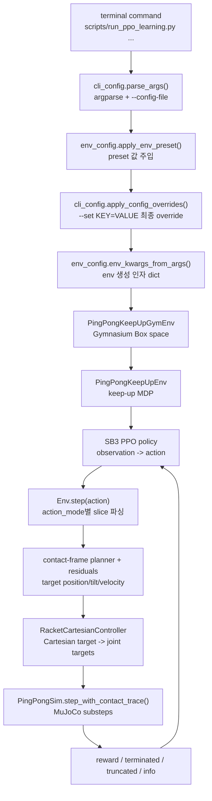
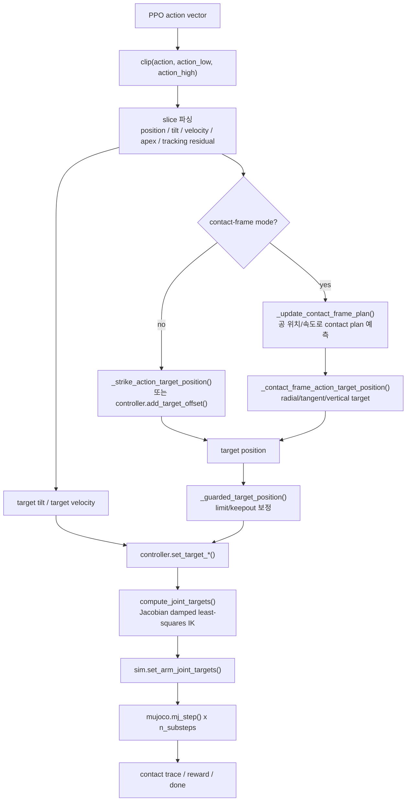

# Control Flow and Terms

이 문서는 `pingpong_rl2`에서 터미널 인자가 최종 로봇팔 움직임까지 전달되는 경로와, 헷갈리기 쉬운 제어/강화학습 용어를 한곳에 모은 것이다.

## 한 줄 요약

터미널 명령은 `args`와 preset을 통해 환경 설정을 만들고, PPO policy는 `action_mode`가 정한 flat action vector를 낸다. `PingPongKeepUpEnv.step()`은 그 action을 contact-frame target/residual로 해석하고, `RacketCartesianController.compute_joint_targets()`가 MuJoCo site Jacobian을 써서 라켓 목표 자세를 7개 관절 목표값으로 바꾼다. MuJoCo는 그 관절 목표를 넣고 여러 physics substep을 진행한다.

## 터미널 인자에서 로봇팔까지

봐야 할 파일은 이 순서다.

| 단계 | 파일 | 역할 |
| --- | --- | --- |
| CLI/config | `scripts/run_ppo_learning.py` | 전체 학습 entrypoint. parse, preset, env, PPO, 저장까지 연결한다. |
| CLI 정의 | `src/pingpong_rl2/training/cli_config.py` | `--config-file`, `--set`, PPO hyperparameter, env 옵션을 파싱한다. |
| preset/env kwargs | `src/pingpong_rl2/training/env_config.py` | preset 적용 뒤 `PingPongKeepUpEnv(**kwargs)` 인자를 만든다. |
| preset 목록 | `src/pingpong_rl2/training/presets.py` | `contact_frame_self_rally_v32_17d_v30_transfer` 같은 실험 preset 정의. |
| Gym wrapper | `src/pingpong_rl2/envs/gym_env.py` | SB3가 보는 `observation_space`, `action_space`, `reset`, `step` wrapper. |
| 핵심 MDP | `src/pingpong_rl2/envs/keepup_env.py` | action parsing, target 생성, reward, termination, info 대부분이 여기 있다. |
| action schema | `src/pingpong_rl2/envs/action_modes.py` | action mode 이름과 residual 계층을 정의한다. |
| observation schema | `src/pingpong_rl2/envs/observation_layout.py` | flat observation vector slice 계약을 만든다. |
| controller | `src/pingpong_rl2/controllers/ee_pose_controller.py` | 라켓 Cartesian target을 관절 target으로 바꾸는 Jacobian 기반 controller. |
| physics wrapper | `src/pingpong_rl2/envs/pingpong_sim.py` | MuJoCo model/data, timestep, substep, contact trace를 관리한다. |

## 한 control step 내부

## Cartesian, Jacobian, IK

| 용어 | 뜻 | 여기서의 역할 |
| --- | --- | --- |
| Cartesian | 관절 각도가 아니라 3D 공간의 위치/방향 좌표. 보통 `x, y, z`와 자세를 뜻한다. | 라켓 중심 site의 목표 위치 `target_position`, 라켓 면 방향 `target_face_normal`, 목표 속도 `target_velocity`가 Cartesian target이다. |
| Jacobian | 작은 관절 변화가 end-effector의 작은 위치/자세 변화를 얼마나 만드는지 나타내는 행렬. | `mujoco.mj_jacSite()`가 라켓 site 기준 position/rotation Jacobian을 계산한다. 이 코드에서는 arm 7관절 column만 뽑아 6x7 task Jacobian을 만든다. |
| IK | Inverse Kinematics. 원하는 end-effector pose를 만들 관절값을 찾는 문제. | 여기서는 analytic IK가 아니라 매 control step마다 작은 `delta_q`를 푸는 Jacobian 기반 differential IK다. |
| Damped least-squares | Jacobian inverse가 불안정하거나 singular에 가까울 때 damping을 넣어 안정화하는 풀이. | `delta_q = J.T @ solve(J @ J.T + damping * I, task_error)` 형태로 구현되어 있다. |
| Nullspace | 라켓 task를 거의 유지하면서 남는 관절 자유도. | 자세를 home 쪽으로 당기거나, 공과 robot body clearance를 확보하는 보조 이동을 넣는다. |

코드 위치는 `src/pingpong_rl2/controllers/ee_pose_controller.py`의 `RacketCartesianController.compute_joint_targets()`다. 결론적으로 이 프로젝트의 로봇팔 제어는 "policy가 관절을 직접 밀어준다"가 아니라 "policy가 라켓 목표/residual을 정하고, Jacobian 기반 controller가 관절 target으로 번역한다"에 가깝다.

## Timestep, Step, Episode

| 용어 | 뜻 | 현재 값/주의점 |
| --- | --- | --- |
| MuJoCo timestep | 물리 엔진이 한 번 적분하는 가장 작은 시간 간격. | `assets/scene.xml`에서 `0.002`초다. |
| control_dt | env/controller가 action 하나를 적용하는 제어 주기. | `DEFAULT_CONTROL_DT = 0.02`초다. |
| substep | control step 하나 안에서 도는 MuJoCo physics step. | `0.02 / 0.002 = 10`, 즉 env step 하나에 MuJoCo step 10번. |
| env step / Gym step | policy action 하나를 받아 reward/info를 반환하는 한 번의 `env.step()`. | `PingPongKeepUpEnv.step()` 한 번이며, 내부적으로 10 substep을 돈다. |
| total_timesteps | SB3 PPO가 수집할 전체 env transition 수. | vector env 전체 합산 기준이다. 예: `700000`이면 physics substep 수와는 다르다. |
| n_envs | 병렬 환경 수. | 주력 run은 `4`. |
| n_steps | PPO가 update 전에 환경 하나당 모으는 rollout 길이. | 주력 run은 `512`. `n_envs=4`면 한 rollout buffer는 `512 * 4 = 2048` transition. |
| rollout | PPO가 policy update 전에 모아둔 observation/action/reward 묶음. | `n_steps * n_envs` 크기 단위로 학습에 들어간다. |
| batch_size | rollout buffer를 나눠 policy update에 쓰는 mini-batch 크기. | 주력 run은 `512`. |
| n_epochs | 같은 rollout buffer를 몇 번 반복해서 PPO update할지. | 주력 run은 `1`. bootstrap의 `epochs`와는 별개다. |
| episode | reset부터 실패, 성공 조건 종료, time limit까지의 한 시행. | 주력 preset은 `max_episode_steps=0`으로 env는 무제한이고, 평가에는 `evaluation_step_limit=7200` safety cap을 둔다. |
| terminated | MDP 의미의 종료. 실패, 제한 위반, 명시 성공/실패 조건 등. | reward와 failure reason 계산 뒤 결정된다. |
| truncated | time limit 같은 외부 제한으로 끊긴 종료. | `max_episode_steps`가 있을 때 step count로 걸린다. |
| reset | 새 episode 시작 상태를 샘플링하는 일. | seed가 있으면 같은 난수열로 재현할 수 있다. 강화학습이 아니게 되는 것은 아니다. |

## Residual

Residual은 "처음부터 전부 직접 만드는 명령"이 아니라 "기본 controller/planner가 만든 값에 policy가 더하는 보정값"이다.

예를 들어 contact-frame planner가 공의 예상 접촉 위치, 목표 apex, 기본 라켓 속도를 계산한다. policy action은 그 위에 "조금 더 왼쪽", "z 속도는 1.1배", "apex를 3cm 올림", "tracking xy를 더 당김" 같은 residual을 얹는다. 이렇게 하면 policy가 물리 전체를 맨바닥에서 배우지 않아도 되고, 사람이 만든 안정적인 구조 위에서 미세 조정을 학습한다.

주의할 점은 residual도 action limit 안에서만 적용된다는 것이다. `action_high/action_low`가 각 residual의 최대 보정 폭을 정한다.

## Action Mode

`action_mode`는 action vector의 의미와 차원을 정한다. 뒤로 갈수록 contact-frame planner가 만든 기본 타격 계획에 residual을 더 많이 붙인다.

| action_mode | 차원 | action slice | 의미 |
| --- | ---: | --- | --- |
| `position` | 3 | `[0:3]` | 라켓 target position에 직접 xyz offset을 더한다. |
| `position_strike` | 3 | `[0:3]` | 공을 치기 위한 strike target helper 위에 xyz residual을 얹는다. |
| `position_tilt` | 5 | `[0:3]`, `[3:5]` | position offset + pitch/roll tilt residual. |
| `position_strike_tilt` | 5 | `[0:3]`, `[3:5]` | strike target + tilt residual. |
| `position_strike_tilt_lift` | 6 | `[0:3]`, `[3:5]`, `[5]` | strike/tilt에 follow-up lift residual을 추가. |
| `position_contact_frame` | 5 | `[0:3]`, `[3:5]` | 공 기준 radial/tangent/vertical contact-frame position residual + tilt residual. |
| `position_contact_frame_velocity_residual` | 8 | `[5:8]` 추가 | outgoing ball velocity residual. `[5]`는 z scale, `[6:8]`은 xy velocity add. |
| `position_contact_frame_velocity_tilt_residual` | 11 | `[8]`, `[9:11]` 추가 | racket vertical velocity residual + trajectory/centering tilt scale residual. |
| `position_contact_frame_velocity_tilt_lateral_residual` | 13 | `[11:13]` 추가 | racket xy velocity residual. |
| `position_contact_frame_velocity_tilt_lateral_apex_residual` | 15 | `[13]`, `[14]` 추가 | target apex z residual + strike plane z residual. |
| `position_contact_frame_velocity_tilt_lateral_apex_tracking_residual` | 17 | `[15:17]` 추가 | tracking xy residual까지 포함한 현재 주력 17D schema. |

현재 주의 깊게 볼 것은 17D 모드인 `position_contact_frame_velocity_tilt_lateral_apex_tracking_residual`이다. v32, v36, v39, v40 계열이 모두 이 mode를 썼다.

| run | timesteps | preset | action_mode | 비고 |
| --- | ---: | --- | --- | --- |
| `keep1_v32_17d` | 200,000 | `contact_frame_self_rally_v32_17d_v30_transfer` | `position_contact_frame_velocity_tilt_lateral_apex_tracking_residual` | 17D 기준점. |
| `keep1_v36_17d_balanced_xyz012` | 800,000 | `contact_frame_self_rally_v32_17d_v30_transfer` | `position_contact_frame_velocity_tilt_lateral_apex_tracking_residual` | balanced xyz 분포. |
| `keep1_v39_17d_mid_curriculum_fixed` | 700,000 | `contact_frame_self_rally_v32_17d_v30_transfer` | `position_contact_frame_velocity_tilt_lateral_apex_tracking_residual` | 현재 발표/웹 기준 모델. |
| `keep1_v40_17d_v39_polish` | 300,000 | `contact_frame_self_rally_v32_17d_v30_transfer` | `position_contact_frame_velocity_tilt_lateral_apex_tracking_residual` | v39 후속 polish 후보. |

## Observation Slice Contract

PPO는 dict가 아니라 flat vector를 본다. 그래서 `observation_layout.py`가 "몇 번째부터 몇 번째까지가 무슨 값인지"를 고정한다. 이것이 slice 계약이다.

기본 `position` mode의 observation은 35차원이다.

| slice | component |
| --- | --- |
| `[0:7]` | joint positions |
| `[7:14]` | joint velocities |
| `[14:17]` | racket position |
| `[17:20]` | racket velocity |
| `[20:23]` | target position |
| `[23:26]` | ball position |
| `[26:29]` | ball velocity |
| `[29:32]` | ball relative position |
| `[32:34]` | predicted intercept relative xy |
| `[34:35]` | predicted intercept time |

현재 17D mode에서 기본 옵션으로 생성하면 40차원이고, 위 35차원 뒤에 아래가 붙는다.

| slice | component |
| --- | --- |
| `[35:38]` | racket face normal |
| `[38:40]` | target tilt |

따라서 저장된 모델과 다른 observation option/action mode로 평가하면 policy 입력 의미가 달라져서 결과가 깨질 수 있다.

## 남겨둔 질문 답변 정리

| 원래 질문 | 답변 |
| --- | --- |
| slice 계약이 뭐지? | flat observation vector에서 component별 구간을 고정하는 약속이다. 저장된 policy는 이 순서와 길이를 기준으로 학습된다. |
| reset 전에도 왜 속성 접근이 가능해야 하나? | Gym/SB3 wrapper, model catalog, `training_config()`, `observation_slices` 같은 코드가 첫 reset 전에도 env 속성을 읽을 수 있기 때문이다. 생성자에서는 안전한 기본 0 상태만 만들고 실제 episode 상태는 reset에서 다시 세팅한다. |
| seed는 시행을 일관되게 해주는 건가, 그러면 RL이 아닌가? | seed는 reset 분포와 노이즈를 재현 가능하게 할 뿐이다. policy는 여전히 rollout reward를 보고 action 분포를 업데이트하므로 강화학습이다. |

## 디버깅할 때 보는 순서

1. 내가 준 terminal 옵션이 실제로 들어갔는지: run directory의 `*_training_summary.json`에서 `config`와 `env_config` 확인.
2. action 차원이 맞는지: `action_mode.py`와 `keepup_env.py`의 `action_high` 생성부 확인.
3. policy 출력이 어느 슬롯인지: `keepup_env.py`의 `step()` 초반 `applied_action[...]` slice 확인.
4. target position/tilt/velocity가 어떻게 만들어졌는지: `_contact_frame_action_target_position()`, `_update_contact_frame_plan()`, `_contact_frame_velocity_target()` 확인.
5. 관절 target으로 어떻게 바뀌는지: `ee_pose_controller.py`의 `compute_joint_targets()` 확인.
6. 실제 물리가 몇 번 도는지: `pingpong_sim.py`의 `n_substeps`와 `step_with_contact_trace()` 확인.
7. reward/종료가 왜 그렇게 나왔는지: `keepup_env.py`의 reward terms와 failure reason info 확인.

## Mermaid로 더 보기

이 파일의 flowchart는 Mermaid 문법이다. VS Code Markdown Preview, GitHub, Mermaid 지원 viewer에서 바로 그림으로 볼 수 있다. 그림이 안 보이는 환경에서는 코드 블록 안의 노드 이름만 따라가도 호출 순서가 유지된다.
