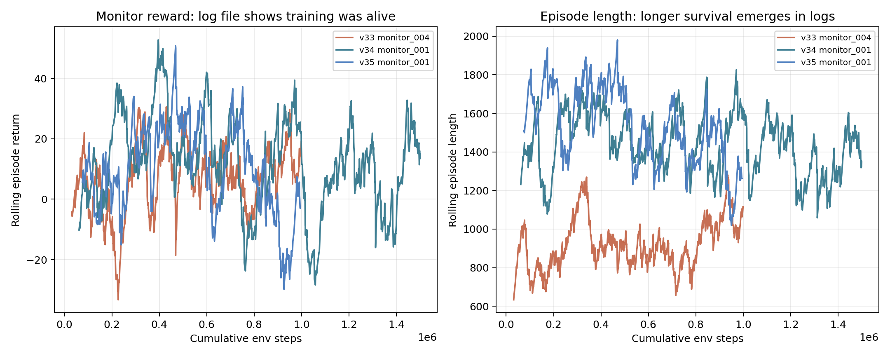

# 학습 세팅과 트러블슈팅 정리

## 한 줄 요약

학습이 안 되는 것처럼 보였던 문제는 대부분 `preset/config`, `horizon`, `로그 확인 방식`, `분석 step limit`이 어긋난 데서 왔다. 강화학습 실험은 “명령어 하나 실행”보다, 어떤 과제를 어떤 기준으로 평가하는지 고정하는 일이 먼저였다.

## 1. preset 없이 실행하면 다른 문제를 학습한다

관련 보고서: [47_run_ppo_learning_preset_config_reference.md](../report/47_run_ppo_learning_preset_config_reference.md)

`run_ppo_learning.py`에서 `--preset`은 단순 별칭이 아니다. 아래를 한 번에 고정한다.

- action mode
- observation 확장
- reset distribution
- reward/success/failure 기준
- PPO hyperparameter
- evaluation step limit

따라서 self-rally 실험은 항상 config file 또는 preset으로 시작해야 한다.

좋은 발표 문장:

> 초기에 학습이 불안정했던 이유 중 하나는, 강화학습 알고리즘보다 환경 계약이 더 중요했기 때문이다. preset 없이 돌리면 현재 목표와 다른 baseline 과제를 학습하게 된다.

## 2. 로그가 안 떠도 학습은 진행 중일 수 있다

사용자가 v33 학습 중 겪은 상황:

- 터미널에 8초 정도 아무 로그가 안 보임
- `artifacts/ppo_runs/keep1_v33_17d_perf/monitor_*.monitor.csv`는 계속 생성됨
- 중간에 Ctrl-C로 끊으면서 monitor 파일이 여러 개 생김

확인법:

```bash
ls -lh artifacts/ppo_runs/<run_name>
tail -f artifacts/ppo_runs/<run_name>/monitor_001.monitor.csv
```

monitor CSV는 보통 아래 형식이다.

```text
episode_return, episode_length, elapsed_time
```

v33에서 monitor 파일이 여러 개 생긴 이유는 중간 중단/재시작 때문이다. 이상 현상은 아니지만, summary가 0-step run으로 덮이면 `completed_timesteps`가 실제 학습량과 다르게 보일 수 있다. 이때는 model zip과 monitor 파일, analysis 결과를 함께 봐야 한다.

추천 시각화:



발표 포인트:

- SB3 로그는 rollout/update 시점에 찍히므로 처음 몇 초 조용할 수 있다.
- `python -u`를 쓰면 stdout buffering을 줄일 수 있다.
- monitor CSV는 학습 생존 신호다.

## 3. 1800-step 분석과 7200-step 분석은 목적이 다르다

1800-step 분석:

- v25의 `30+ useful bounce` 목표를 보기 좋다.
- 100 episodes를 비교하기 빠르다.
- 단기 안정성, failure mode 비교에 좋다.

7200-step 분석:

- `contacts 300 / useful 100` 같은 장기 랠리 목표를 봐야 할 때 필요하다.
- 1800-step에서는 물리적으로 300 contact가 잘 안 나온다.
- 좋은 모델일수록 오래 걸린다.

실제 사례:

- v34 1800-step eval100: mean useful `30.57`, max contacts `116`
- v34 7200-step eval20: mean useful `116.05`, mean contacts `318.55`, max contacts `426`

해석:

> 1800-step 결과만 보면 v34가 평범해 보이지만, 목표가 300 contact/100 useful라면 7200-step 평가가 맞다.

## 4. reset distribution은 한 번에 넓히면 안 된다

v28/v29/v31에서 확인한 교훈:

- `xy`, `velocity`, `spin`, action dimension을 한 번에 바꾸면 성능이 급락할 수 있다.
- 이때 실패는 PPO가 나빠서가 아니라 과제 난도가 갑자기 바뀐 것이다.
- 성공적인 확장은 v30처럼 “기존 안정 모델에서 한 변수만 넓히기”였다.

현재 추천 순서:

1. 기존 안정 모델에서 resume
2. action space bounds는 가능하면 유지
3. reset XY/Z/velocity는 curriculum으로 천천히 확장
4. reward cap/evaluation step limit을 목표 horizon에 맞춤
5. 분석은 같은 seed와 같은 step limit으로 비교

## 5. low-apex 기준은 낮추기보다 grace를 먼저 늘린다

v33에서 low-apex failure가 많았다. 하지만 useful 기준까지 낮추면 낮은 공을 계속 치는 loop를 성공으로 착각할 수 있다.

현재 구조:

- useful minimum apex: 대략 `0.20m`
- low-apex termination threshold: `0.14m`
- v34에서는 threshold를 유지하고 grace를 `3 -> 6`으로 늘림

결과:

- v34 long eval에서 low-apex failure는 `0/20`
- 대신 새 병목은 ball-out/body contact로 이동

좋은 발표 문장:

> 낮은 공을 바로 실패로 끊지 않도록 recovery 기회를 늘렸지만, useful contact 기준은 유지했다. 그래서 낮은 통통 루프를 성공으로 세지 않고, 회복 가능한 상황만 더 허용했다.

## 6. 안정적인 학습 명령 형태

conda 환경을 이미 활성화했다는 전제:

```bash
cd /Users/pilt/project-collection/ros2/mujoco/pingpong_rl2

PYTHONPATH=src python -u scripts/run_ppo_learning.py \
  --config-file configs/keep1_v32_17d_transfer.json \
  --set run_version=<new_run_version> \
  --set resume_from=<source_model.zip> \
  --set total_timesteps=1000000 \
  --set learning_rate=3e-6 \
  --set n_epochs=1 \
  --set clip_range=0.02 \
  --set eval_episodes=100 \
  --set evaluation_step_limit=7200 \
  --set bootstrap_heuristic_episodes=0 \
  --set bootstrap_epochs=0 \
  --set bootstrap_followup_epochs=0
```

주의:

- `conda run`은 활성화된 shell에서는 빼도 된다.
- 긴 명령에서 `\` 뒤에 공백이 있으면 다음 줄 escape가 깨질 수 있다.
- `resume_from`을 명시하면 어떤 모델에서 시작했는지 summary의 `starting_model_path`도 확인한다.
- action dimension이나 action bound를 바꾸면 기존 zip resume이 깨질 수 있다.

## 7. 분석 명령 형태

단기 비교:

```bash
PYTHONPATH=src python -u scripts/run_ppo_rebound_analysis.py \
  --model-path artifacts/ppo_runs/<run>/<run>_model.zip \
  --episodes 100 \
  --seed 231 \
  --episode-step-limit 1800 \
  --analysis-name <run>_eval100
```

장기 목표 검증:

```bash
PYTHONPATH=src python -u scripts/run_ppo_rebound_analysis.py \
  --model-path artifacts/ppo_runs/<run>/<run>_model.zip \
  --episodes 20 \
  --seed 231 \
  --episode-step-limit 7200 \
  --analysis-name <run>_long7200_eval20
```

발표용 최종 비교는 20 episode보다 50 또는 100 episode가 더 좋지만, 시간이 오래 걸린다.

## 8. 강화학습답게 보이는 근거

발표에서 아래를 강조하면 “PID/퍼지에 가까운 것 아닌가?”라는 질문에 대응하기 좋다.

- 같은 controller 위에서 RL이 residual action을 학습한다.
- action 차원을 늘릴 때 policy weight transfer와 zero-init으로 안정성을 보존했다.
- reset distribution을 curriculum으로 확장했다.
- useful contact, next intercept reachable, long-horizon target을 기준으로 평가했다.
- action usage와 ablation으로 어떤 action 축이 실제 성능에 기여하는지 검증했다.

핵심 문장:

> controller는 물리적으로 가능한 타격 primitive를 제공하고, RL은 그 위에서 어떤 residual을 어느 상황에 써야 장기 랠리가 유지되는지 학습한다.
